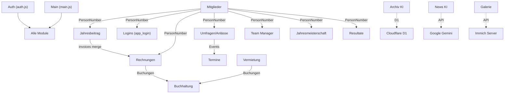

# Architektur-Analyse: Vereinsportal Sportschützen Muhen

**Stand:** 2026-09-19  
**Phase:** 1 – Bestandsanalyse  
**Autor:** Automatisierte Code-Analyse  
**Status:** ABGESCHLOSSEN – Durch Projektverantwortlichen verifiziert

---

## Inhaltsverzeichnis

1. [Ist-Architektur](#1-ist-architektur)
2. [Frontend-Struktur](#2-frontend-struktur)
3. [Backend-Struktur](#3-backend-struktur)
4. [Login & Authentifizierung](#4-login--authentifizierung)
5. [Rollen & Berechtigungen](#5-rollen--berechtigungen)
6. [Datenmodell / Google Sheets](#6-datenmodell--google-sheets)
7. [Google-Sheets-Abhängigkeiten](#7-google-sheets-abhängigkeiten)
8. [API-Struktur](#8-api-struktur)
9. [Cloudflare](#9-cloudflare)
10. [Sicherheitsmodell](#10-sicherheitsmodell)
11. [Datumsverarbeitung](#11-datumsverarbeitung)
12. [Bekannte technische Risiken](#12-bekannte-technische-risiken)
13. [Abhängigkeiten zwischen Modulen](#13-abhängigkeiten-zwischen-modulen)
14. [Vorschlag für schrittweise Migration](#14-vorschlag-für-schrittweise-migrati## 1. Ist-Architektur

### Architektur-Überblick

Das Gesamtsystem besteht aus **drei Frontends**, die über Cloudflare Worker Gateways und Google Apps Script (GAS) auf ein gemeinsames Backend aus Google Spreadsheets sowie zusätzliche Dienste zugreifen:

```
┌────────────────────────────────────────────────────────────────────────────────────────┐
│                                   BENUTZER (Browser)                                   │
│    Desktop / Tablet (Vorstand)        Smartphone (Mitglieder)        Öffentlich / Web  │
└───────────────┬──────────────────────────────────┬────────────────────────────┬────────┘
                │ HTTPS                            │ HTTPS                      │ HTTPS
                ▼                                  ▼                            ▼
┌────────────────────────────────────────────────────────────────────────────────────────┐
│                                   DREI FRONTENDS                                       │
│                    (Hosting: GitHub Pages & Web-Server / Custom Domain)                │
│                                                                                        │
│  1. Vorstand-Portal (SPA):    vorstand/index.html + vorstand/js/*                      │
│  2. Mitglieder-App (PWA):     index.html + app.js + app/*                              │
│  3. Vereins-Website:          sportschuetzen-website/frontend/*                        │
└───────────────┬──────────────────────────────────┬────────────────────────────┬────────┘
                │ HTTPS (fetch)                    │ HTTPS (fetch)              │ HTTPS (fetch)
                ▼                                  ▼                            ▼
┌────────────────────────────────────────────────────────────────────────────────────────┐
│                           CLOUDFLARE WORKERS (API-Gateways)                            │
│                                                                                        │
│  v1-vorstand.js (Haupt-API Vorstand-Portal)                                            │
│  ├── Proxy → Google Apps Script (11 Module)                                            │
│  ├── Natives Modul: Archiv-KI (Cloudflare D1 + AI)                                     │
│  ├── Natives Modul: News-KI (Google Gemini)                                            │
│  ├── Natives Modul: Gesichtserkennung (Faces)                                          │
│  ├── Natives Modul: Resultate-KI OCR                                                   │
│  └── Natives Modul: Immich Galerie-Proxy                                               │
│                                                                                        │
│  worker_github-dropdown-refresh.js (Mitglieder-App & Upload)                           │
│  ├── Standblatt-Upload (Speicherung in Cloudflare R2)                                  │
│  ├── Eventplaner API (RSVP, Teilnehmer mit Lizenz-Lookup)                              │
│  ├── Mitglieder-Auth (Members100 + Vorstand_Login Proxy)                               │
│  └── Haus-Kalender (Belegungsabfrage)                                                  │
│                                                                                        │
│  App- & Website-Spezifische Hilfs-Worker:                                              │
│  ├── termine.dan-hunziker73.workers.dev (Termine-Feed)                                 │
│  ├── jahresmeisterschaft-muhen.dan-hunziker73.workers.dev (Jahresmeisterschaft)         │
│  └── gruppe.dan-hunziker73.workers.dev (Gruppen & Mannschaft)                          │
│                                                                                        │
│  sportschuetzen-website-worker.js (Öffentliche Vereins-Website)                        │
│  ├── Immich Fotogalerie Proxy (CORS-Bypass & Caching)                                  │
│  └── Facebook & Instagram Graph API Proxy                                              │
└───────────────┬──────────────────────────────────┬────────────────────────────┬────────┘
                │ HTTPS (fetch, redirect: follow)  │                            │
                ▼                                  ▼                            ▼
┌────────────────────────────────────────────────────────────────────────────────────────┐
│                              GOOGLE APPS SCRIPT (Backend)                              │
│                                                                                        │
│  Vorstand_Login_GAS     → Spreadsheet-ID: 1s4B6fYIezLJUnROjM_TIcijVtwWJQL1yl08n2JS3fFo│
│  Members100_GAS         → Spreadsheet-ID: 11G9LdZhghm8U-Dpsv4NOyBg5mm5xlD2nhU10BQNvq3A│
│  Eventplaner_GAS        → Spreadsheet-ID: 1lN180zraGTBsxxb7uJid7607nLHrBNxmoLjLH8jZWiE│
│  Admin_GV_GAS           → Spreadsheet-ID: 1q54RIa3Oo3DT1ONIkAgsvv5-qAhU1UuV0KvLP0f-PyI│
│  Buchhaltung_GAS        → Spreadsheet-ID: 1C3jbge0YVcmOxNgCkks3A-z8m9kLKrXNxpZwI3FQcpA│
│  Rechnungen_GAS         → Spreadsheet-ID: 1D3tbMHVNzf-VzTyP1DnGQ4MXqtjw7H1hlV4NY2X-wfE│
│  Vereinsinventar_GAS    → Spreadsheet-ID: 183MBGdaNw_qSZdNQPTxui3gsend9pOkpEpC2K3G7O2U│
│  Jahresmeisterschaft_GAS (Original) → ID: 1ye7nbT1lLLYzilwNhw6NnslwvUrtxFuT-ZZJRrG2sT0│
│  Jahresmeisterschaft_GAS (KI-Basis) → ID: 1Dihy7Xey4DIko8Qw0qnzzRtVqx7TftLueCmUXT7Uv5g│
│  vermietung_GAS         → Spreadsheet-ID: 1T_HpoVzfJsI47RAHN4_EmHZgTPHMSNnk5pIgPs0R43A│
│  mannschaft_homepage_GAS→ Spreadsheet-ID: 1VuOv6b8r5m1g_9ZidPR3OPZ7YIwLUm6dYLC9nKmC2mE│
└────────────────────────────────────────┬───────────────────────────────────────────────┘
                                         │
                                         ▼
┌────────────────────────────────────────────────────────────────────────────────────────┐
│                              GOOGLE SHEETS (Datenbank)                                 │
│        10 Master-Spreadsheets mit zahlreichen Tabellenblättern & Verknüpfungen         │
└────────────────────────────────────────────────────────────────────────────────────────┘
```

### Technologie-Stack

| Schicht | Technologie / Komponente | Details / Verwendung |
|:--------|:-------------------------|:---------------------|
| **Frontend 1 (Vorstand)** | HTML5, Bootstrap 5.3.0, Font Awesome 6.4, Vanilla JS | Single-Page Application im Ordner `vorstand/` (Verwaltung, Finanzen, Mitglieder) |
| **Frontend 2 (Mitglieder)** | HTML5, CSS3, Vanilla JS, PWA | Progressive Web App im Ordner `app/` + Root `index.html`/`app.js` (Mobile First) |
| **Frontend 3 (Website)** | HTML5, CSS3, Vanilla JS, Web Components | Öffentliche Vereinshomepage im Ordner `sportschuetzen-website/` |
| **Hosting Frontends** | GitHub Pages & Web-Server | `sportschuetzen-muhen.github.io/sportschuetzen/` (sowie künftige Domain `sportschuetzen-muhen.ch`) |
| **API-Gateways** | Cloudflare Workers | `v1-vorstand`, `worker_github-dropdown-refresh`, `sportschuetzen-website-worker` + Hilfs-Worker (`termine`, `jahresmeisterschaft`, `gruppe`) |
| **File Storage** | Cloudflare R2 | `MY_BUCKET` für Standblatt-Uploads |
| **Backend (Legacy)** | Google Apps Script (11 Projekte) | Schnittstellen zu Google Sheets (doGet/doPost) |
| **Datenbank (Legacy)** | Google Sheets | 10 Tabellen-Dokumente als relationale Datenspeicher-Ersatz |
| **KI-Archiv** | Cloudflare D1 (SQLite) + Cloudflare AI | `@cf/baai/bge-m3` Vektoreinbettung für Protokollsuche |
| **News-KI** | Google Gemini API | Gemini 2.5 Flash / 2.0 Flash Lite für Berichtserstellung |
| **Push-Benachrichtigungen** | OneSignal | App-ID `fe30b2b7-...` |
| **Social Media** | Facebook & Instagram Graph API | Automatisierte Beitragserstellung über Worker-Proxy |
| **Bibliotheken (CDN)** | Verschiedene JS-Libs | SignaturePad, jsPDF, html2canvas, SortableJS, SheetJS (xlsx), Mammoth, piexif, face-api.js, Chart.js |

#### Self-Hosted Server-Infrastruktur (Proxmox VE)

Neben den Cloud-Diensten (Cloudflare, Google) betreibt der Verein einen zentralen Virtualisierungs-Server auf Basis von **Proxmox VE**:

- **Proxmox VE Host:** Zentraler Server für Container (LXC) und virtuelle Maschinen (VMs).
- **Supabase (Zielarchitektur):** Die künftige relationale Datenbank (PostgreSQL), Authentifizierung (Supabase Auth), Row-Level Security (RLS) und Storage werden als self-hosted Instanz auf diesem Proxmox-Server laufen.
- **Paperless-NGX:** Ein bestehender Paperless-NGX Server läuft bereits auf demselben Proxmox-Host. Er dient als Dokumenten-Management-System (DMS) für die revisionssichere Archivierung von Protokollen, Quittungen, Verträgen und Vereinsdokumenten.
- **Immich:** Ein bestehender Immich-Server (Fotoverwaltung, angebunden unter `immich-muhen.danfamily.uk`) läuft ebenfalls auf diesem Proxmox-Host und stellt Vereinsfotos und Alben bereit.
---

## 2. Frontend-Struktur

Im Gesamtprojekt existieren **drei separate Frontends**, die jeweils unterschiedliche Benutzergruppen und Anwendungsfälle bedienen, aber alle auf dieselbe Google-Sheets-Datenbasis zugreifen:

1. **Frontend 1 – Vorstand-Portal (`vorstand/`):** Single-Page Application (SPA) für Desktop und Tablet zur Verwaltung des gesamten Vereins (Mitglieder, Finanzen, Buchhaltung, Rechnungen, Vermietung, Archiv).
2. **Frontend 2 – Mitglieder-App (`app/` + Root `index.html`, `app.js`):** Mobile-First PWA für Vereinsmitglieder zum Abrufen von Terminen, RSVP bei Anlässen, Erfassen von Jahresmeisterschafts-Resultaten (Standblatt-Upload) und Kalenderabfrage.
3. **Frontend 3 – Vereins-Website (`sportschuetzen-website/`):** Öffentliche Website für Vereinsauftritt, News/Berichte, Vermietungsanfragen (Schützenhaus), Immich-Fotogalerien, Resultate-Anzeige sowie geplanter geschützter Mitglieder-Bereich.

---

### Frontend 1: Vorstand-Portal (SPA)

#### Einstiegspunkt

- **Datei:** `vorstand/index.html` (1604 Zeilen, 89 KB)
- **Typ:** Single-Page Application (SPA)
- **Alle Module** sind als `<div class="module-view">` in einer einzigen HTML-Datei eingebettet

#### Navigation / Routing

- **Routing-Funktion:** `navTo(viewId, el)` in `main.js` (Zeile 1188)
- **Mechanismus:** CSS-Klassen-basiert (`module-view.active`), keine URL-basierte Navigation
- **Sidebar:** 260px Desktop, Off-Canvas mobile (< 1200px)
- **Mobile Header:** Hamburger-Menü für Sidebar-Toggle

#### Module (Views)

| View-ID | Bezeichnung | Sichtbar für Rollen | Frontend-Dateien |
|:--------|:------------|:-------------------|:-----------------|
| `dashboard` | Übersicht | Alle | `main.js` |
| `inventar` | Inventar | admin, vorstand, materialwart, schuetzenmeister, aktuar, kassier, vermieter | `inventar/` (6 Dateien) |
| `termine` | Jahresprogramm | admin, vorstand, schuetzenmeister, aktuar, kassier, vermieter | `termine.js` |
| `system-mails` | System-Mails | admin, vorstand, schuetzenmeister, aktuar, kassier | `system-mails.js` |
| `umfragen` | Anlässe & Umfragen | admin, vorstand, schuetzenmeister, aktuar, kassier | `umfragen/` (6 Dateien) |
| `manager` | Team Manager | admin, vorstand, schuetzenmeister | `manager/` (6 Dateien) |
| `resultate` | Resultate | admin, vorstand, schuetzenmeister | `resultate/` (4 Dateien) |
| `vermietung` | Vermietung | admin, vorstand, vermieter, kassier | `vermietung/` (4 Dateien) |
| `jahresmeisterschaft` | Jahresmeisterschaft KK | admin, vorstand, schuetzenmeister, aktuar, kassier | `jahresmeisterschaft/` (4 Dateien) |
| `mail` | Mail | admin, vorstand, schuetzenmeister, aktuar, kassier | `mail.js` |
| `jahresbeitrag` | Jahresbeitrag | admin, vorstand, kassier | `jahresbeitrag/` (8 Dateien) |
| `rechnungen` | Rechnungen | admin, vorstand, kassier | `rechnungen/` (5 Dateien) |
| `buchhaltung` | Buchhaltung | admin, kassier | `buchhaltung/` (4 Dateien) + `buchhaltung-controlling.js` |
| `mitglieder` | Mitglieder | admin, vorstand, schuetzenmeister, aktuar | `mitglieder/` (8 Dateien) |
| `archiv` | Vereins-Archiv & KI | admin, vorstand, schuetzenmeister, aktuar, kassier | `archiv.js` |
| `meeting-recorder` | Meeting-Recorder | admin, vorstand, schuetzenmeister, aktuar, kassier | `meeting-recorder.js` |
| `news` | News KI | admin, vorstand, schuetzenmeister, aktuar, kassier | `news.js` |
| `galerie` | Galerie Manager | admin, vorstand, schuetzenmeister, aktuar, kassier | `galerie.js` |
| `logins` | Logins | admin | `logins/` (4 Dateien) |

### CSS-System

- **Kein externes CSS-File**: Alle Styles sind inline im `<style>`-Block des `<head>` (ca. 525 Zeilen)
- **Design-System (CSS Custom Properties):**
  - `--primary: #0f3a5d`
  - `--primary-light: #eef2ff`
  - `--bg: #f8fafc`
  - `--card-bg: rgba(255, 255, 255, 0.85)` (Glassmorphism)
  - `--radius-lg: 16px`, `--radius-md: 12px`, `--radius-sm: 8px`
  - `--shadow-sm/md/lg`
  - `--transition: all 0.3s cubic-bezier(0.4, 0, 0.2, 1)`

### Responsive Verhalten

- **Desktop:** > 1200px – Sidebar permanent sichtbar
- **Tablet:** 768px – 1199px – Sidebar als Overlay (Off-Canvas)
- **Mobile:** < 767px – Sidebar als Overlay, angepasste Touch-Targets (12px Padding in Tabellen), swipeable Tabs

### Zentrale Utilities (`main.js`)

- `escapeHtml(str)` – XSS-Schutz
- `escapeJs(str)` – JS-String-Escaping für HTML-Attribute
- `isoToDisplay(val)` – ISO → CH-Format (DD.MM.YYYY)
- `displayToIso(val)` – CH-Format → ISO
- `AppState` – Zentrales State-Management (Observer-Pattern)
- `AppCache` – LocalStorage-Cache mit Versionierung und TTL (120 Min Standard)
- `Validation` – Formularvalidierung (E-Mail, CH-Telefon, CH-Datum, Zahlen)
- `showError()` / `showSuccess()` / `showToast()` – Toast-Benachrichtigungen
- `showLoadingOverlay()` / `hideLoadingOverlay()` – Lade-Overlay
- `apiFetchWithLoading()` – API-Wrapper mit Loading-State
- `userHasRole(role)` – Rollen-Check
- `hasWriteAccess(module)` – Schreibrecht-Matrix-Prüfung
- `bgModuleLoader` – Sequentieller Hintergrund-Modul-Loader (10s Intervall)
- `silentInitialLoad()` – Initiales Bulk-Loading (Jahresbeitrag + Mitglieder)
- `runBackgroundSync()` – 5-Minuten Background Sync

### API-Kommunikation

- **Zentrale Funktion:** `apiFetch(module, paramsOrObj, options)` in `auth.js`
- **Worker-URL:** `https://v1-vorstand-api.dan-hunziker73.workers.dev/`
- **Methoden:** GET und POST
- **Header:** `X-CSRF-Token`, `X-User-Role`, `Content-Type: application/json`
- **URL-Schema:** `WORKER_URL?module=<modul>&action=<aktion>&...`

### Fehlerbehandlung

- Toast-Benachrichtigungen (Bootstrap-basiert) über `showError()`, `showSuccess()`, `showToast()`
- Console-Logging mit Emoji-Präfixen (🔐, 📡, ⚠️, ❌, ✅)
- `AppState.setError(error)` für zentrales Error-Tracking
- Try/Catch in allen API-Calls

### Frontend 2: Mitglieder-App (Mobile PWA)

- **Dateien:** Root `index.html`, `app.js`, `style.css`, Subviews im Ordner `app/` (`app_anlaesse.html`, `app_jahresmeisterschaft.html`, `app_kalender.html`, `app_mannschaft.html`, `app_standblatt.html`)
- **Typ:** Progressive Web App (PWA) mit Service Worker und Manifest, optimiert für Smartphone-Nutzung
- **Hauptfunktionen:**
  - Login via SSV-PersonNumber oder PIN (`app_login`)
  - Standblatt-Upload für KK-Jahresmeisterschaft (Bildaufnahme & Cloudflare R2 Upload)
  - Eventplaner / RSVP-Rückmeldungen für Schiessanlässe und Helfereinsätze
  - Jahresprogramm / Termine-Feed und Hauskalender-Belegungsanzeige
- **Backend-Anbindung:** Kommuniziert über `worker_github-dropdown-refresh.js` sowie Hilfs-Worker (`termine.dan-hunziker73.workers.dev`, `jahresmeisterschaft-muhen.dan-hunziker73.workers.dev`, `gruppe.dan-hunziker73.workers.dev`) direkt mit den Google Sheets (Members100, Eventplaner, Termine, Jahresmeisterschaft).

### Frontend 3: Vereins-Website (`sportschuetzen-website/`)

- **Dateien:** `sportschuetzen-website/frontend/` (`index.html`, `verein.html`, `schuetzenhaus_vermietung.html`, `resultate.html`, `storno_feedback.html`, `admin.html`, `galerie-editor.html`, Web Components)
- **Typ:** Öffentliche Vereins-Website und Redaktionssystem
- **Hauptfunktionen:**
  - Öffentliche Präsentation des Vereins, Trainingsangebote, Schiesssport-News, Kontakt
  - Schützenhaus-Vermietung: Buchungsanfrage-Formular und Storno-/Feedback-System
  - Immich-Fotogalerien (Proxy via `sportschuetzen-website-worker.js`)
  - Resultate-Übersicht & Gruppenmeisterschaften (dynamisch aus Hilfs-Workern gespeist)
  - Redaktionssystem (`admin.html` / `galerie-editor.html`): Erstellung von Vereinsberichten mit KI-Unterstützung (Gemini) und Galerie-Synchronisation
  - Geplanter geschützter Bereich für Mitglieder (Protokolle, interne Fotos, etc.), vorbereitet via `auth-session.js`
- **Backend-Anbindung:** Greift für Termine, Resultate, Vermietungs-Buchungen und Berichte auf Worker-Endpunkte und damit auf die Google Sheets zu.

---

## 3. Backend-Struktur

### Google Apps Script Projekte

| GAS-Projekt | Spreadsheet-ID | Zweck | Wichtigste Dateien |
|:------------|:--------------|:------|:------------------|
| **Vorstand_Login_GAS** | `1s4B6fYIezLJUnROjM_TIcijVtwWJQL1yl08n2JS3fFo` | Login, Passwort-Hashing, Session-Tracking, User-Sync | `API_Passwort_Hashing.js` |
| **Members100_GAS** | `11G9LdZhghm8U-Dpsv4NOyBg5mm5xlD2nhU10BQNvq3A` | Mitglieder-Master-DB, SSV-Sync, Lizenzen, Funktionen, Beiträge | `doget_dopost.js`, `syncHandlers.js`, `config.js` |
| **Eventplaner_GAS** | `1lN180zraGTBsxxb7uJid7607nLHrBNxmoLjLH8jZWiE` | RSVP-System, Umfragen, Tracking | `dogetdopost.js` |
| **Admin_GV_GAS** | `1q54RIa3Oo3DT1ONIkAgsvv5-qAhU1UuV0KvLP0f-PyI` | Termine, GV-Einladungen, OneSignal-Push | `doget_dopost.js`, `write_termine.js`, `Core_GV_Invitation.js` |
| **Buchhaltung_GAS** | `1C3jbge0YVcmOxNgCkks3A-z8m9kLKrXNxpZwI3FQcpA` | Doppelte Buchhaltung, Kontenrahmen | `doget_dopost.js`, `config.js` |
| **Rechnungen_GAS** | `1D3tbMHVNzf-VzTyP1DnGQ4MXqtjw7H1hlV4NY2X-wfE` | Rechnungsstellung, PDF-Generierung | `doget_dopost.js`, `pdf_generator.js`, `config.js` |
| **Vereinsinventar_GAS** | `183MBGdaNw_qSZdNQPTxui3gsend9pOkpEpC2K3G7O2U` | Inventar-Verwaltung, Ausgabe/Rückgabe | `doget_dopost.js` |
| **Jahresmeisterschaft_GAS_Original** | `1ye7nbT1lLLYzilwNhw6NnslwvUrtxFuT-ZZJRrG2sT0` | KK-Meisterschaft, Resultate-Import (Legacy / Fallback) | 31 Dateien |
| **Jahresmeisterschaft_GAS_neue_Version_KI_Erkennung** | `1Dihy7Xey4DIko8Qw0qnzzRtVqx7TftLueCmUXT7Uv5g` | KK-Meisterschaft, Resultate-Import mit KI/OCR (**Präferiert**, in Testphase) | 31 Dateien |
| **vermietung_GAS** | `1T_HpoVzfJsI47RAHN4_EmHZgTPHMSNnk5pIgPs0R43A` | Schützenhaus-Vermietung, Formulare, Booking | `doget.js`, `dopost.js`, `Auto_Mail.js` |
| **mannschaft_homepage_GAS** | `1VuOv6b8r5m1g_9ZidPR3OPZ7YIwLUm6dYLC9nKmC2mE` | Team Manager, Mannschafts-Homepage | `mannschaft_homepage_doget_dopost.gs` |

> ⚠️ **Wichtiger Hinweis zur doppelten Jahresmeisterschaft:**  
> Für die Jahresmeisterschaft existieren aktuell zwei GAS-Projekte bzw. Spreadsheet-Datenbanken:
> 1. `Jahresmeisterschaft_GAS_Original` (Spreadsheet-ID: `1ye7nbT1lLLYzilwNhw6NnslwvUrtxFuT-ZZJRrG2sT0`): Ursprüngliche Version.
> 2. `Jahresmeisterschaft_GAS_neue_Version_KI_Erkennung` (Spreadsheet-ID: `1Dihy7Xey4DIko8Qw0qnzzRtVqx7TftLueCmUXT7Uv5g`): Neue Version auf Basis automatisierter KI-/OCR-Erkennung von Standblättern.
> 
> **Status & Präferenz:** Die **neue Version auf Basis KI ist präferiert** und bildet die funktionale Vorlage für die Supabase-Zielarchitektur. Sie ist jedoch aktuell noch nicht ganz fertig getestet, weshalb die Original-Version vorerst parallel vorgehalten wird.

### GAS-Endpunkte (doGet/doPost)

#### Vorstand_Login_GAS – Endpunkte

| Action | Methode | Beschreibung |
|:-------|:--------|:-------------|
| `checkLogin` | GET | Login-Prüfung (SHA-256 Hash-Vergleich) |
| `getMembers` | GET | Alle User (admin + member) auflisten |
| `ping` | GET | Online-Präsenz tracken |
| `changeMyPassword` | GET | Passwort des angemeldeten Users ändern |
| `getPdfLink` | GET | Google Drive PDF-Link abrufen |
| `getLogins` | GET | Beide Login-Tabellen und Sessions auslesen |
| `saveLoginDaten` | GET | Admin-Login Daten speichern |
| `addLoginDaten` | GET | Admin-Login hinzufügen |
| `deleteLoginDaten` | GET | Admin-Login löschen |
| `saveAppLogin` | GET | Mitglieder-Login speichern |
| `addAppLogin` | GET | Mitglieder-Login hinzufügen |
| `deleteAppLogin` | GET | Mitglieder-Login löschen |
| `syncAppUsers` | GET | App-User aus Master-DB synchronisieren |

#### Eventplaner_GAS – Endpunkte

| Action | Methode | Beschreibung |
|:-------|:--------|:-------------|
| `getRSVPEvents` | GET | RSVP-Events laden (mit Tracking) |
| `getParticipants` | GET | Teilnehmer eines Events |
| `setRSVP` | GET/POST | RSVP-Anmeldung setzen |
| `getAllEventsAdmin` | GET | Admin: Alle Events laden |
| `trackView` | GET/POST | View-Tracking |
| `getICS` | GET | iCal-Export |
| `getResponsesLog` | GET | Antwort-Protokoll |
| `getViewsLog` | GET | View-Protokoll |
| `getPollResults` | GET | Umfrage-Ergebnisse |
| `saveEventsAdmin` | POST | Events admin speichern |
| `sendGroupMail` | POST | Gruppen-Mail versenden |
| `uploadEventDocument` | POST | Dokument nach Google Drive hochladen |

#### Members100_GAS – Endpunkte (abgeleitet aus config.js)

- `getMembers` / `getMember` / `saveMember` / `deleteMember`
- `getLicenses` / `getFunctions` / `getTraining` / `getHistory`
- `getParticipations` / `getBeitraege` / `getPositionen` / `getGebuehren`
- `syncFromSSV` / `diffImport` / diverse Sync-Aktionen

> **TODO / UNKLAR:** Die vollständige Liste aller Endpunkte der restlichen GAS-Projekte (Buchhaltung, Rechnungen, Inventar, Vermietung, JM) konnte in dieser Analyse nur teilweise ermittelt werden. Die doGet/doPost-Dateien dieser Module sind umfangreich (26-50 KB) und müssen bei Bedarf einzeln analysiert werden.

---

## 4. Login & Authentifizierung

### Übersicht der Login-Bereiche (3 Frontends)

Im Gesamtsystem gibt es derzeit **zwei aktive Login-Mechanismen** und ein **drittes geplantes Login**:

1. **Vorstand-Portal (`vorstand/`): 1x Admin/Vorstand-Login (Aktiv)**
   - **Zielgruppe:** Vorstandsmitglieder, Schützenmeister, Aktuar, Kassier, Vermieter, Materialwart, Administratoren.
   - **Identifikation:** Benutzername (Freitext aus Tabelle `login_daten`, z.B. "admin" oder Nachname).
   - **Authentifizierung:** Passwort-Eingabe → SHA-256-Hash → Vergleich gegen Spalte E (`passwort_hash`) in `login_daten`.
   - **Rollen:** Rückgabe von Primärrolle und Mehrfachrollen (`roles[]`), Steuerung der Modulsichtbarkeit und Schreibrechte.

2. **Mitglieder-App (`app/` + `index.html`): 2x Login-Identifikatoren (Aktiv)**
   - **Zielgruppe:** Alle lizenzierten Schützen und Vereinsmitglieder.
   - **Identifikation (zwei Möglichkeiten):**
     - **Möglichkeit A:** SSV-Personennummer (`PersonNumber`, z.B. offizielle Schützen-Lizenznummer).
     - **Möglichkeit B:** 6-stellige Adressnummer / PIN (`AddressNumber` bzw. `addressnumber_pin`, ggf. zero-padded).
   - **Authentifizierung:** Abgleich gegen Tabelle `app_login`. Als Passwort wird sowohl der Hash des PINs (raw und 6-stellig padded) als auch ein individuell gesetztes Passwort akzeptiert.
   - **Berechtigung:** Standard-Rolle `member`; schaltet Standblatt-Uploads, Eventplaner/RSVP und Termine frei.

3. **Vereins-Website (`sportschuetzen-website/`): 1x Geschützter Bereich (Geplant / Vorbereitet)**
   - **Zielgruppe:** Vereinsmitglieder und Vorstand auf der öffentlichen Homepage.
   - **Zweck:** Geschützter Bereich für nicht-öffentliche Vereinsinhalte: GV- und Vorstandsprotokolle, interne Berichte, hochauflösende Fotogalerien (Immich) und vereinsinterne Downloads.
   - **Aktueller Stand im Code:** Es existiert bereits ein SSO- und Ticket-Manager (`sportschuetzen-website/frontend/js/auth-session.js`), der Session-Tickets (`?auth_session=...`) aus der Mitglieder-App entgegennehmen und synchronisieren kann (inkl. Rollen-Check wie `isVorstand()`, `hasRole('member')`).
   - **Ziel mit Supabase:** Nahtlose Zusammenführung aller drei Frontends unter einem einheitlichen **Supabase Auth (JWT)** Login mit granularen Row-Level-Security (RLS) Policies.

### Login-Ablauf (Ist-Zustand)

```
1. Benutzer gibt Benutzername / PIN + Passwort ein
2. Frontend hasht Passwort mit SHA-256 (crypto.subtle.digest)
3. fetch → Worker → GAS mit: user=<username/pin>&pw=<sha256hash>
4. GAS prüft je nach Kontext:
   a) Tabelle "login_daten" (Vorstand-Portal): Username-Matching
   b) Tabelle "app_login" (Mitglieder-App): PersonNumber- oder PIN/AddressNumber-Matching
5. Hash-Vergleich: gespeicherter Hash === übermittelter Hash
6. Erfolg → Response: { success, name, role, roles[], mailadresse, ... }
7. Frontend speichert Identität in localStorage / sessionStorage und initialisiert Views
```

### Benutzeridentifikation

- **Vorstand-Login (`login_daten`):** Username (Freitext), z.B. "admin" oder Vorname/Nachname
- **Mitglieder-Login (`app_login`):** Zwei Eingabewege möglich:
  1. `PersonNumber` (offizielle SSV-Personennummer)
  2. `AddressNumber` / `PIN` (6-stellig, zero-padded)
- **Matching-Logik in GAS:** Prüfung gegen PersonNumber, PIN (raw) und PIN (padded auf 6 Stellen)

### Passwort-Authentifizierung

- **Algorithmus:** SHA-256 (kein Salt, kein Pepper, kein Key-Stretching)
- **Frontend-Hashing:** `crypto.subtle.digest('SHA-256', ...)` in `auth.js`
- **Backend-Hashing:** `Utilities.computeDigest(Utilities.DigestAlgorithm.SHA_256, ...)` in GAS
- **Speicherung:** SHA-256-Hash in Google Sheet (Spalte E), Klartext-Passwort parallel in Spalte B (!)
- **PIN-Sonderlogik:** Beim Mitglieder-Login wird auch Hash des PINs (raw + padded) als Passwort akzeptiert

> **⚠️ SICHERHEITSRISIKO:** Passwörter werden im Klartext UND als unsalted SHA-256 Hash gespeichert. Bei einer Migration zu Supabase Auth wird dies durch bcrypt/scrypt ersetzt.

### Session-Speicherung

| Speicherort | Schlüssel | Inhalt |
|:-----------|:----------|:-------|
| `localStorage` | `portal_user` | Anzeigename des Benutzers |
| `localStorage` | `portal_role` | Primäre Rolle |
| `localStorage` | `portal_roles` | Komma-separierte Rollenliste |
| `localStorage` | `portal_login_id` | Login-ID (Username oder PIN) |
| `localStorage` | `portal_personnumber` | PersonNumber aus GAS |
| `localStorage` | `portal_mailadresse` | E-Mail-Adresse |
| `localStorage` | `portal_mailanzeige` | E-Mail (Rückwärtskompatibilität) |
| `localStorage` | `portal_rolle_extern` | Externe Rolle |
| `localStorage` | `portal_last_login` | Zeitstempel letzter Login |
| `sessionStorage` | `csrf_token` | CSRF-Token (generiert im Frontend) |
| `sessionStorage` | `portal_session_id` | Session-ID für Presence-Tracking |

### Session-Ablauf

- **Kein explizites Session-Timeout** im Frontend
- **Presence-Ping:** Alle 60 Sekunden wird ein Ping an GAS gesendet
- **Server-seitiges Timeout:** GAS markiert Sessions nach 5 Minuten Inaktivität als offline
- **Abbruch:** localStorage wird bei `doLogout()` gelöscht; Session endet mit Browser-Schließen oder manueller Abmeldung

### Passwortänderung

- Benutzer gibt altes Passwort + neues Passwort ein (Frontend-Modal)
- Action `changeMyPassword` in GAS
- Altes Passwort wird als SHA-256-Hash geprüft
- Neues Passwort wird in Klartext (Spalte B) UND als Hash (Spalte E) geschrieben

### Passwort-Reset

- **TODO / UNKLAR:** Kein dedizierter "Passwort vergessen"-Flow im Code erkannt. Reset vermutlich manuell durch Admin über das Logins-Modul.

---

## 5. Rollen & Berechtigungen

### Bestehende Rollen

| Rolle | Typ | Beschreibung |
|:------|:----|:-------------|
| `admin` | Admin-Login | Vollzugriff auf alle Module |
| `vorstand` | Admin-Login | Zugriff auf die meisten Module |
| `schuetzenmeister` | Admin-Login | Schiessbetrieb, Teams, Resultate |
| `aktuar` | Admin-Login | Protokolle, Mitglieder, Termine |
| `kassier` | Admin-Login | Finanzen, Rechnungen, Buchhaltung |
| `vermieter` | Admin-Login | Vermietung Schützenhaus |
| `materialwart` | Admin-Login | Inventar-Verwaltung |
| `member` | Mitglieder-Login | App-Login (eingeschränkter Zugriff) |
| `gast` | Fallback | Standard-Rolle bei fehlendem Login |

### Mehrfach-Rollen

- Ein Admin-Login kann **mehrere Rollen** haben (komma-separiert in Spalte C der `login_daten`-Tabelle)
- Beispiel: `admin,kassier`
- `currentRoles` ist ein Array, `userRole` ist die erste Rolle

### Berechtigungs-Umsetzung

1. **Frontend-Sichtbarkeit:** `data-roles` Attribut auf `.role-protected` Elementen
2. **Schreibrechte:** `hasWriteAccess(module)` Matrix in `main.js` (Zeile 1162-1186)
3. **UI-Schutz:** `.write-protected` Klasse → Buttons werden `d-none`, Inputs werden `disabled/readonly`
4. **Backend-Schutz:** Worker prüft `X-User-Role` Header (Zeile 139), aber **KEINE serverseitige Rollenvalidierung** gegen die DB
5. **GAS-Ebene:** Keine Berechtigungsprüfung – GAS führt jede Aktion aus, die über den Worker kommt

> **⚠️ SICHERHEITSRISIKO:** Die Rollenprüfung erfolgt ausschliesslich im Frontend. Ein böswilliger Benutzer könnte durch manuelle API-Requests die Rollenprüfung umgehen. Dies ist ein Kernargument für RLS in Supabase.

### Schreibrecht-Matrix (Frontend)

| Modul | admin | vorstand | schuetzenmeister | aktuar | kassier | vermieter | materialwart |
|:------|:-----:|:--------:|:----------------:|:------:|:-------:|:---------:|:------------:|
| inventar | ✓ | ✓ | ✓ | ✓ | ✓ | – | – |
| termine | ✓ | ✓ | ✓ | ✓ | – | – | – |
| umfragen | ✓ | ✓ | ✓ | ✓ | ✓ | – | – |
| manager | ✓ | ✓ | ✓ | – | – | – | – |
| vermietung | ✓ | ✓ | – | – | ✓ | ✓ | – |
| jahresmeisterschaft | ✓ | ✓ | ✓ | ✓ | ✓ | – | – |
| jahresbeitrag | ✓ | ✓ | – | – | ✓ | – | – |
| rechnungen | ✓ | ✓ | – | – | ✓ | – | – |
| buchhaltung | ✓ | – | – | – | – | – | – |
| mitglieder | ✓ | ✓ | ✓ | ✓ | – | – | – |
| logins | ✓ | – | – | – | – | – | – |

---

## 6. Datenmodell / Google Sheets

### Spreadsheet: Vorstand_Login (`1s4B6f...`)

#### Tabelle: `login_daten` (Admin-Logins)

| Spalte | Index | Feld | Beschreibung |
|:-------|:------|:-----|:-------------|
| A | 0 | `username` | Benutzername |
| B | 1 | `passwort` | Klartext-Passwort (!!) |
| C | 2 | `rolle` | Rolle(n), komma-separiert |
| D | 3 | `anzeigename` | Anzeige-Name |
| E | 4 | `passwort_hash` | SHA-256 Hash |
| F | 5 | `mailadresse` | E-Mail |
| G | 6 | `rolle_extern` | Externe Rolle |
| H | 7 | `personnumber` | PersonNumber (Verknüpfung zu Members) |

#### Tabelle: `app_login` (Mitglieder-Logins)

| Spalte | Index | Feld | Beschreibung |
|:-------|:------|:-----|:-------------|
| A | 0 | `personnumber` | PersonNumber (SSV) |
| B | 1 | `addressnumber_pin` | 6-stellige PIN (AddressNumber) |
| C | 2 | `firstname` | Vorname |
| D | 3 | `lastname` | Nachname |
| E | 4 | `passwort_hash` | SHA-256 Hash |

#### Tabelle: `login_sessions`

| Spalte | Index | Feld |
|:-------|:------|:-----|
| A | 0 | `sessionId` |
| B | 1 | `username` |
| C | 2 | `loginTime` |
| D | 3 | `lastActive` |
| E | 4 | `durationMin` |
| F | 5 | `durationSec` |
| G | 6 | `ip` |
| H | 7 | `userAgent` |

### Spreadsheet: Members100 (`11G9Ld...`)

#### Tabelle: `members` (Haupt-Mitglieder-Stamm)

46 Spalten gemäss `MEMBERSHEADERS` in `config.js`:

`PersonNumber`, `AddressNumber`, `Salutation`, `FirstName`, `LastName`, `Company`, `Addition`, `Street`, `PostCode`, `City`, `Country`, `BusinessLandlinePhone`, `BusinessMobilePhone`, `PrivateLandlinePhone`, `PrivateMobilePhone`, `PrimaryEmail`, `AdditionalEmail`, `Webpage`, `Gender`, `BirthDate`, `InsuranceNumber`, `Language`, `Nationality`, `OrganizationNumber`, `OrganizationName`, `IsActive`, `IsPassive`, `IsPassiveSource`, `IsHonoraryMember`, `IsHonoraryMemberSource`, `ClubEntryDate`, `ClubEntryDateSource`, `FirstClubEntryDateSSV`, `HonoraryMemberSince`, `HonoraryMemberSinceSource`, `Deceased`, `Remark`, `NewsletterSSVType`, `ExportedOn`, `Rechnungsversand`, `Niemahnen`, `IBAN`, `BIC`, `Kontoinhaber`, `Vereinsaustritt`, `Todesdatum`, `lastupdated`, `lastupdatedby`, `Valid_From`, `Valid_To`, `Ist_Aktuell`

**Schlüssel:** `PersonNumber` (SSV-Personennummer)

#### Tabelle: `licenses` (Lizenzen)

`PersonNumber`, `MembershipCategory`, `EntryDate`, `ExitDate`, `LicenseCategory`, `LicenseType`, `LicenseInvoicingClubNumber`, `LicenseInvoicingClubName`, `IsActive`, `lastupdated`, `importquelle`

**Schlüssel:** `PersonNumber` (FK → members)

#### Tabelle: `functions` (Funktionen)

`PersonNumber`, `OfficialFunctionCategory`, `OfficialFunctionRemark`, `OfficialFunctionEntryDate`, `OfficialFunctionExitDate`, `UseOnBoardAndFunctionaryReport`, `rabattkategorie`, `lastupdated`, `importquelle`

**Schlüssel:** `PersonNumber` (FK → members)

#### Tabelle: `training` (Ausbildungen)

`PersonNumber`, `CourseCategory`, `Module`, `CompletedTrainingDate`, `TrainingStatus`, `CompletedTrainingExpirationDate`, `lastupdated`

#### Tabelle: `participations` (Teilnahmen)

`id`, `PersonNumber`, `year`, `eventkey`, `teilgenommen`, `quelle`, `erfasstam`, `erfasstvon`

#### Tabelle: `contributions_header` (Beitrags-Kopfdaten)

`id`, `PersonNumber`, `year`, `status`, `Gesamt`, `paymentdate`, `paymentmethod`, `documentref`, `createdat`, `updatedat`

#### Tabelle: `contributions_positions` (Beitrags-Positionen)

`id`, `headerid`, `PersonNumber`, `year`, `positionnr`, `beschreibung`, `betrag`, `typ`, `sourcefield`, `lastupd`

#### Tabelle: `history` (Änderungshistorie)

`id`, `PersonNumber`, `name`, `datum`, `ereignistyp`, `alterwert`, `neuerwert`, `periodstart`, `periodend`, `phasekey`, `phasetype`, `source`, `importid`, `erfasstam`, `erfasstvon`

### Spreadsheet: Eventplaner (`1lN180...`)

- **events** – Event-Definitionen (RSVP)
- **responses** – RSVP-Antworten
- **views** – Tracking (wer hat was gesehen)

> **TODO / UNKLAR:** Detaillierte Spaltenstruktur der Eventplaner-Tabellen muss aus `dogetdopost.js` extrahiert werden (911 Zeilen).

### Weitere Spreadsheets (IDs eingetragen)

Die Spreadsheet-IDs für alle weiteren Backend-Projekte wurden ermittelt und zugeordnet:

- **Admin_GV_GAS** (`1q54RIa3Oo3DT1ONIkAgsvv5-qAhU1UuV0KvLP0f-PyI`): Termine, GV-Einladungen, Präsenzen, Push-Trigger
- **Buchhaltung_GAS** (`1C3jbge0YVcmOxNgCkks3A-z8m9kLKrXNxpZwI3FQcpA`): Doppelte Buchhaltung, Kontenrahmen, Journal, Bilanz, Erfolgsrechnung
- **Rechnungen_GAS** (`1D3tbMHVNzf-VzTyP1DnGQ4MXqtjw7H1hlV4NY2X-wfE`): Rechnungsstellung, PDF-Generierung, Positionen
- **Vereinsinventar_GAS** (`183MBGdaNw_qSZdNQPTxui3gsend9pOkpEpC2K3G7O2U`): Inventar-Artikel, Ausleihe/Rückgabe, Transaktionen
- **Jahresmeisterschaft_GAS (Original)** (`1ye7nbT1lLLYzilwNhw6NnslwvUrtxFuT-ZZJRrG2sT0`): KK-Meisterschaft, Resultate-Import (Legacy / Fallback)
- **Jahresmeisterschaft_GAS (KI-Erkennung)** (`1Dihy7Xey4DIko8Qw0qnzzRtVqx7TftLueCmUXT7Uv5g`): KK-Meisterschaft mit KI-/OCR-Standblatt-Erkennung (**Präferierte Version**, in Testphase)
- **vermietung_GAS** (`1T_HpoVzfJsI47RAHN4_EmHZgTPHMSNnk5pIgPs0R43A`): Schützenhaus-Vermietung, Buchungen, Fixdaten, Storno/Feedback
- **mannschaft_homepage_GAS** (`1VuOv6b8r5m1g_9ZidPR3OPZ7YIwLUm6dYLC9nKmC2mE`): Team Manager, Grenzland Cup, Gruppen

---

## 7. Google-Sheets-Abhängigkeiten

| Modul (Frontend) | GAS-Projekt | Google Sheet(s) | Lesen | Schreiben |
|:-----------------|:------------|:----------------|:-----:|:---------:|
| Login | Vorstand_Login_GAS | login_daten, app_login, login_sessions | ✓ | ✓ |
| Mitglieder | Members100_GAS | members, licenses, functions, training, history, participations | ✓ | ✓ |
| Jahresbeitrag | Members100_GAS | contributions_header, contributions_positions, positionen_config, gebuehren_config | ✓ | ✓ |
| Umfragen | Eventplaner_GAS | events, responses, views | ✓ | ✓ |
| Termine | Admin_GV_GAS | Termine-Sheet | ✓ | ✓ |
| Buchhaltung | Buchhaltung_GAS | Journal, Kontenrahmen, etc. | ✓ | ✓ |
| Rechnungen | Rechnungen_GAS | Rechnungen, Positionen | ✓ | ✓ |
| Inventar | Vereinsinventar_GAS | Inventar-Artikel, Transaktionen | ✓ | ✓ |
| Vermietung | vermietung_GAS | Buchungen, Fixdaten | ✓ | ✓ |
| Jahresmeisterschaft | Jahresmeisterschaft_GAS (KI-Version präferiert) | Ranglisten, Resultate, Standblatt-OCR | ✓ | ✓ |
| Manager | mannschaft_homepage_GAS | Teams, Gruppen | ✓ | ✓ |
| Archiv | Worker-nativ (D1) | Cloudflare D1 | ✓ | ✓ |
| News | Worker-nativ (KI) | – (nur Gemini API) | – | – |

---

## 8. API-Struktur

### Cloudflare Worker: v1-vorstand.js

**URL:** `https://v1-vorstand-api.dan-hunziker73.workers.dev/`

**Routing-Schema:**
```
?module=<modul>&action=<aktion>&...
```

**Konfigurierte GAS-Module:**

| module | GAS-Script-URL | Kategorie |
|:-------|:--------------|:----------|
| `inventar` | `AKfycbzH6dHv3nVcT6L_ep9P-...` | GAS-Proxy |
| `termine` | `AKfycbxoItTn9_HUJ0frtfN-...` | GAS-Proxy |
| `admin` (auch `logins`) | `AKfycbxg7qWgyyJOqCgUuHM7m...` | GAS-Proxy |
| `manager` | `AKfycbz2kJZfmb9-SX-7rm8J2...` | GAS-Proxy |
| `vermietung` | `AKfycbxnClehly9t5TLZqguQO...` | GAS-Proxy |
| `mail` | `AKfycbwWsYEaaK7OqCpL1ihB_...` | GAS-Proxy |
| `jahresbeitrag` / `mitglieder` | `AKfycbyiJBjqfLWYuQeY89s2l...` | GAS-Proxy (gleiche URL!) |
| `jahresmeisterschaft` | `AKfycbwhX0N01rKpZmEnwMpyK...` | GAS-Proxy |
| `umfragen` | `AKfycbzwDg-lk38hZiLUZQCXR...` | GAS-Proxy |
| `rechnungen` | `AKfycbwUxiK9LibWZ01mfeEw-...` | GAS-Proxy |
| `buchhaltung` | `AKfycbyuGmNadHzSJQXGKK2tV...` | GAS-Proxy |
| `archiv` | – (D1 + AI nativ) | Worker-nativ |
| `news` | – (Gemini API nativ) | Worker-nativ |
| `faces` | – (nativ) | Worker-nativ |
| `resultate` | – (OCR nativ) | Worker-nativ |
| `immich` | – (Proxy nativ) | Worker-nativ |

**Module-Aliases:**
- `gv` → `termine`
- `auto-mail` → `termine`
- `logins` → `admin`
- `jahresmeister-schaft-kk` → `termine`

**Öffentliche Module (kein Login nötig):**
- `admin` (nur `checkLogin`-Action)
- `vermietung` (nur `booking` und `feedback` Actions)
- `immich` (Album/Image-Proxy)
- `vision_ocr`

### Cloudflare Worker: sportschuetzen-website-worker.js

**Zweck:** Proxy für öffentliche Vereins-Website

**Module:**
- Immich Fotogalerie Proxy (Bild, Video, Album – CORS-Bypass mit Edge-Caching)
- Facebook Graph API Proxy (Page Feed, Publishing)
- Instagram Graph API Proxy (Media Publishing, Container Upload)

**Env-Variablen (Secrets):**
- `FACEBOOK_PAGE_ACCESS_TOKEN`
- `INSTAGRAM_BUSINESS_ACCOUNT_ID` (TODO / UNKLAR ob in env oder hardcodiert)
- `GEMINI_API_KEY` (für News-Worker)

---

## 9. Cloudflare

### Worker-Konfiguration

| Worker | Domain | Version |
|:-------|:-------|:--------|
| v1-vorstand.js | `v1-vorstand-api.dan-hunziker73.workers.dev` | `2026-09-14-v5-multichannel-social` |
| sportschuetzen-website-worker.js | TODO / UNKLAR | TODO / UNKLAR |

### CORS-Konfiguration

- `Access-Control-Allow-Origin: *` (vollständig offen)
- `Access-Control-Allow-Methods: GET, POST, OPTIONS`
- `Access-Control-Allow-Headers: Accept, Content-Type, X-CSRF-Token, X-User-Role, Authorization`

### Cloudflare-Dienste

| Dienst | Verwendung |
|:-------|:-----------|
| **Workers** | API-Gateway, KI-Proxy, Social Media Proxy |
| **D1** | SQLite-Datenbank für Protokoll-Archiv (KI-Suche) |
| **AI** | `@cf/baai/bge-m3` Embedding-Modell für Vektorsuche |
| **KV** | TODO / UNKLAR (nicht im analysierten Code gefunden) |
| **R2** | TODO / UNKLAR (nicht im analysierten Code gefunden) |

### Umgebungsvariablen / Secrets

| Variable | Worker | Typ |
|:---------|:-------|:----|
| `DB` | v1-vorstand | D1 Database Binding |
| `AI` | v1-vorstand | AI Binding |
| `GEMINI_API_KEY` | v1-vorstand | Secret |
| `FACEBOOK_PAGE_ACCESS_TOKEN` | sportschuetzen-website | Secret |
| `SportschuetzenMuhenArchiv2026` | v1-vorstand | Hardcodierter API-Key (!) |

> **⚠️ SICHERHEITSRISIKO:** Der API-Key `SportschuetzenMuhenArchiv2026` ist im Worker-Code hardcodiert und somit in Git sichtbar.

---

## 10. Sicherheitsmodell

### Aktuelle Sicherheitsebenen

| Ebene | Mechanismus | Bewertung |
|:------|:-----------|:----------|
| **Transport** | HTTPS (GitHub Pages + Cloudflare) | ✅ OK |
| **CSRF** | Frontend-generiertes Token in Header | ⚠️ Schwach (Token ist nur client-seitig, nicht server-validiert) |
| **Authentifizierung** | SHA-256 Hash (unsalted) | ⚠️ Schwach |
| **Session** | localStorage (kein Expiry) | ⚠️ Schwach |
| **Autorisierung** | Frontend-Rollencheck + X-User-Role Header | ❌ Unsicher (manipulierbar) |
| **API-Schutz** | CSRF-Token + Rolle im Header | ⚠️ Umgehbar |
| **Daten-Schutz** | Keiner (GAS führt alles aus) | ❌ Unsicher |
| **XSS** | `escapeHtml()` konsequent verwendet | ✅ OK |
| **CORS** | Wildcard `*` | ⚠️ Zu offen |
| **Passwort-Speicherung** | Klartext + unsalted SHA-256 | ❌ Unsicher |

### Bekannte Sicherheitslücken

1. **Keine serverseitige Autorisierung:** Jeder, der den Worker-URL und das CSRF-Token kennt, kann beliebige Module ansprechen
2. **Passwörter im Klartext** in Google Sheets gespeichert
3. **Unsalted SHA-256**: Rainbow-Table Angriffe möglich
4. **CSRF-Token wird im Frontend generiert** und nur als Header mitgesendet – der Server validiert nur die Existenz, nicht den Wert
5. **Hardcodierter API-Key** im Worker-Code (`SportschuetzenMuhenArchiv2026`)
6. **Kein Rate-Limiting** auf API-Endpunkte

---

## 11. Datumsverarbeitung

### Zeitzonen-Konfiguration

- **GAS-seitig:** `const APPTZ = 'Europe/Zurich';` in Members100_GAS config.js
- **Frontend:** Keine explizite Zeitzone gesetzt; `new Date()` verwendet Browserzeitzone
- **Anzeige:** `toLocaleString('de-CH', ...)` für Datumsanzeige

### Datumsformate

| Kontext | Format | Beispiel |
|:--------|:-------|:--------|
| Anzeige (CH) | `DD.MM.YYYY` | `19.09.2026` |
| Speicherung (ISO) | `YYYY-MM-DD` | `2026-09-19` |
| Speicherung (ISO mit Zeit) | `YYYY-MM-DDTHH:mm:ss` | `2026-09-19T11:30:00` |
| Google Sheets | Date-Objekte oder Strings | Gemischt |

### Konvertierungsfunktionen

- `isoToDisplay(val)` – ISO → CH-Anzeige (main.js:24)
- `displayToIso(val)` – CH-Anzeige → ISO (main.js:44)

### Bekannte Datumsfelder (Members100)

18 Datumsfelder gemäss `DATEFIELDS` in config.js:
`BirthDate`, `ClubEntryDate`, `FirstClubEntryDateSSV`, `HonoraryMemberSince`, `Todesdatum`, `Vereinsaustritt`, `EntryDate`, `ExitDate`, `OfficialFunctionEntryDate`, `OfficialFunctionExitDate`, `CompletedTrainingDate`, `CompletedTrainingExpirationDate`, `ExportedOn`, `Valid_From`, `Valid_To`

> **⚠️ RISIKO:** Google Sheets speichert Datumswerte als JavaScript Date-Objekte oder als Strings – die Konvertierung bei der Migration erfordert sorgfältige Prüfung jeder einzelnen Zelle.

---

## 12. Bekannte technische Risiken

| # | Risiko | Schwere | Beschreibung |
|:--|:-------|:--------|:-------------|
| 1 | **Keine serverseitige Autorisierung** | HOCH | API-Requests können mit beliebiger Rolle gestellt werden |
| 2 | **Passwörter im Klartext** | HOCH | Google Sheet enthält Klartext-Passwörter neben Hashes |
| 3 | **Monolithische SPA** | MITTEL | 89 KB HTML + ~1.5 MB JavaScript in einer Seite |
| 4 | **Google Sheets als DB** | MITTEL | Keine Transaktionen, keine referentielle Integrität, Race Conditions bei gleichzeitigen Schreibzugriffen |
| 5 | **LocalStorage als Session** | MITTEL | Kein serverseitiges Session-Management, kein Expiry |
| 6 | **Hardcodierte Secrets** | MITTEL | API-Key im Git-Repository sichtbar |
| 7 | **CORS Wildcard** | NIEDRIG | Jede Domain kann die API ansprechen |
| 8 | **Kein Rate-Limiting** | NIEDRIG | Potenzielle DoS-Anfälligkeit |
| 9 | **Google Sheets Zeilen-IDs** | MITTEL | Einige Module verwenden Sheet-Row-Number als ID (`_row`) – instabil bei Einfügen/Löschen |
| 10 | **Gemischte Datumsformate** | NIEDRIG | Strings und Date-Objekte gemischt in Sheets |

---

## 13. Abhängigkeiten zwischen Modulen



### Kritische Abhängigkeiten

1. **Members100 ist das zentrale Stammdaten-System.** PersonNumber ist der globale Schlüssel, der in fast allen Modulen verwendet wird.
2. **Jahresbeitrag und Rechnungen teilen sich die gleiche GAS-URL** (`mitglieder` und `jahresbeitrag` zeigen auf denselben GAS-Script).
3. **Umfragen/Eventplaner** ist das bestehende Anlass-System – das neue Supabase-Modul ANLÄSSE wird dieses ergänzen, nicht sofort ersetzen.
4. **Buchhaltung** ist das finanztechnisch sensibelste Modul und hängt von Rechnungen und Vermietung ab.

---

## 14. Vorschlag für schrittweise Migration

### Empfohlene Migrations-Reihenfolge (Phasen 0 bis 11)

| Phase | Bereich | Ziel / Inhalt | Begründung & Risiko | Status |
|:------|:--------|:--------------|:--------------------|:-------|
| **0** | **Zielarchitektur + Datenmodell** | Supabase-Struktur, Beziehungen, IDs, Rollen, RLS-Entwurf | **Fundament:** Verhindert zweifaches Bauen von Auth/RLS. (Kein Code-Risiko) | ✅ **Abgeschlossen** |
| **1** | **Auth + Rollen + RLS** | Supabase Auth (JWT), `public.user_roles` als Source of Truth, RLS-Hilfsfunktionen | Sichere gemeinsame Grundlage für alle neuen Tabellen. (Mittel) | ✅ **Abgeschlossen** |
| **2** | **ANLÄSSE (Pilot-Modul)** | Erstes vollständig neues Supabase-Modul: Event-Management, Mengenrechner, Bestellwesen, Checklisten, Helfer/Stände, Vorlagen & Event-Controlling (Projektauftrag Punkte 12–17) | **Pilot:** Keine Legacy-Beeinträchtigung der bestehenden Sheets; isoliert im Vorstand-Portal integriert & getestet. (Niedrig) | ✅ **Abgeschlossen** |
| **3** | **Vermietung** | Erster produktiver Migrationskandidat: Workflow, Kunden, Verträge, Raiffeisen-Abgleich, PDF-Generierung | Abgegrenzter Workflow; Google Calendar bleibt Belegungs-Master. (Niedrig) | ✅ **Abgeschlossen** |
| **4** | **Mitglieder & SSV-Import** | Browser-native SSV-Diff-Engine (ohne GAS), relationale Tabellen (`members`, `member_licenses`, `member_functions`, `member_training`, `member_history`), Dual-Write zur Google Sheet Test-Kopie (`1GdoopFudDXcmrP-DH8z2Ge_ALG3YDmHybJpXe1HgZQ0`) | SSV-Import direkt im Frontend (< 100 ms); Spiegelt Mutationen ins Test-Sheet für Datenkonsistenz zu Satelliten-Sheets. Original-Sheet bleibt geschützt. | ✅ **Abgeschlossen & im Testbetrieb** |
| **5** | **Anlässe / Eventplaner** | Bestehende RSVP-Funktion mit dem neuen Anlässe-Modul zusammenführen | Konsolidierung der Event-Anmeldungen. (Mittel) | Geplant |
| **6** | **Mitglieder (Write-Master)** | Supabase wird Master für Mitglieder-Stammdaten | Schnittstellen & Berechtigungen müssen stehen. (Hoch) | Geplant |
| **7** | **Inventar** | Vereinsinventar, Ausleihe und Rückgabe | Relativ unabhängig von anderen Modulen. (Niedrig) | Geplant |
| **8** | **Jahresmeisterschaft** | Migration auf Basis der neuen KI-/Standblatt-Erkennung | Migration in der Saisonpause nach Abschluss der KI-Tests. (Mittel) | Geplant |
| **9** | **Jahresbeiträge** | Beitragsgenerierung basierend auf Mitgliedern und Funktionen | Abhängig von validen Stammdaten. (Hoch) | Geplant |
| **10** | **Rechnungen** | Fakturierung, PDF-Ablage via Proxmox/Paperless-NGX | Abhängig von Beitrags- und Buchungsdaten. (Hoch) | Geplant |
| **11** | **Buchhaltung** | Doppelte Buchhaltung, Kontenrahmen, Jahresabschluss | Letztes Modul, finanztechnisch sensibel. (Sehr Hoch) | Geplant |

### Parallelbetriebs-Architektur

```text
                 ┌──────────────────────────────────────┐
                 │            Supabase Auth             │
                 │      user_roles (Source of Truth)    │
                 │      JWT roles[] (RLS Cache)         │
                 └──────────────────┬───────────────────┘
                                    │
                             RLS / Policies
                                    │
        ┌───────────────────────────┼───────────────────────────┐
        │                           │                           │
        ▼                           ▼                           ▼
    Mitglieder                  Anlässe                     Vermietung
  (Read-Replica)             (Neues Modul)             (Supabase = Master)
        │                           │                           │
        │                           ├── Teilnehmer              ├── Buchungsstatus
        │                           ├── RSVP / Anmeldungen      ├── Kundendaten
        │                           └── Helfer / Schichten      ├── Vertrag PDF → Supabase Storage
        │                                                       │                  & Paperless-NGX
        ▼                                                       └── Termin-Sync → Google Calendar
   PersonNumber                                                                     (Belegungs-Master)
        │
        ├── Jahresmeisterschaft
        ├── Beiträge
        ├── Rechnungen
        ├── Teams
        └── Funktionen

Google Sheets (Legacy)
      ▲
      │ manueller Sync (nach XLSX-Verbandsimport)
      │
      └── bestehende GAS-Systeme
```

### Nächste Schritte

1. ✅ Bestandsanalyse (dieses Dokument)
2. ⬜ Zielarchitektur dokumentieren (`docs/SUPABASE_ARCHITECTURE.md`)
3. ⬜ Datenmodell entwerfen (`docs/DATABASE_SCHEMA.md`)
4. ⬜ Sicherheitsmodell definieren (`docs/SECURITY_MODEL.md`)
5. ⬜ Migrationsplan erstellen (`docs/MIGRATION_PLAN.md`)
6. ⬜ RLS-Testplan entwickeln (`docs/RLS_TESTPLAN.md`)

---

> **Hinweis:** Dieses Dokument basiert auf der Code-Analyse des Repositories sowie den Ergänzungen und Verifizierungen durch den Projektverantwortlichen (Infrastruktur Proxmox, Frontends, Spreadsheet-IDs, Login-Systeme). Phase 1 (Bestandsanalyse) ist damit vollständig abgeschlossen.
