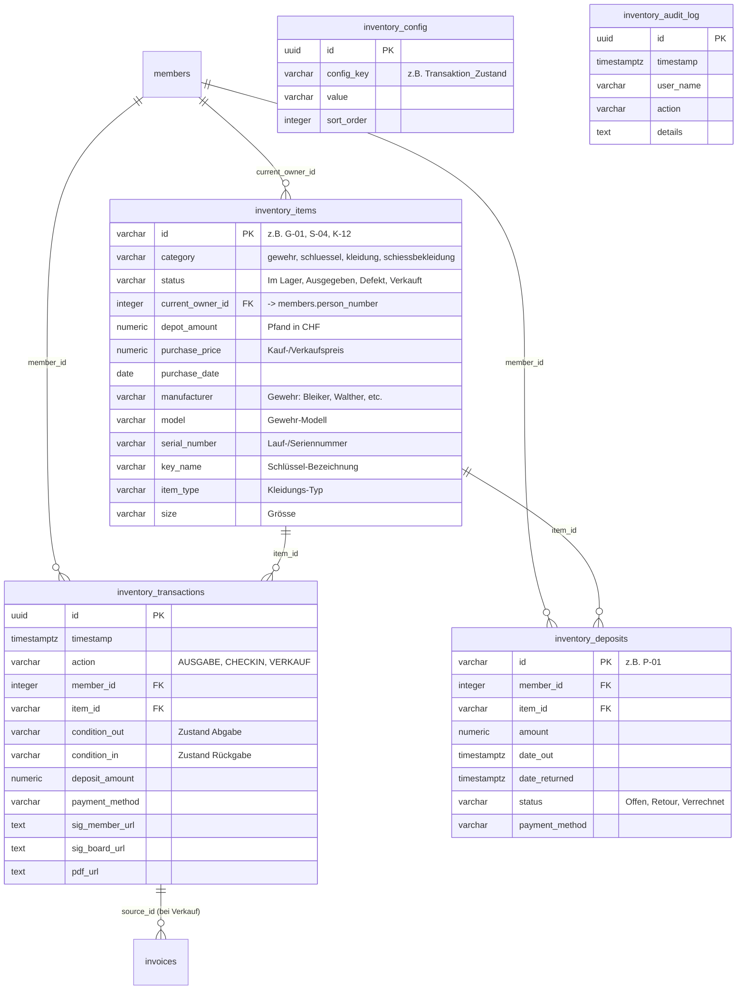

# Fachdokumentation: Inventar- & Materialverwaltung

> **Status:** PRODUKTIV (Supabase Single Source of Truth)  
> **Stand:** Oktober 2026  
> **Komponenten:** `public.inventory_items`, `inventory_transactions`, `inventory_deposits`, `inventory_audit_log`, `inventory_config`, `invoices`, `accounting_journal`  
> **Frontend:** [`vorstand/js/inventar/`](file:///c:/Users/danhu/.gemini/antigravity/scratch/migration%20supabase/vorstand/js/inventar/) (`inventar-core.js`, `inventar-ui.js`, `inventar-cart.js`, `inventar-list.js`, `inventar-journal.js`, `inventar-pdf.js`)  
> **Relevanz für KI:** Definiert die fachlichen Invarianten, Transaktions- und Pfandkassen-Logik, Quittungs-PDF-Generierung, Schnittstellen zu `RechnungsCore` und doppelter Buchhaltung sowie das Berechtigungskonzept.

---

## 1. Übersicht & Systemgrenzen

Das Modul **Inventar-Verwaltung** bildet das operative Herzstück für den Materialwart, den Schützenmeister und den Vorstand der Sportschützen Muhen zur vollständigen Überwachung, Ausleihe, Rücknahme und Verrechnung aller Vereinssachwerte:

* **Gegenstandskategorien:**
  1. **Sportwaffen (`gewehr`):** Kleinkaliber- und Luftgewehre (50m, 10m, 300m) mit Hersteller, Modell, Serien-/Laufnummer, Diopter, Ringkorn, Eigentümer/Spender und Depotbetrag.
  2. **Schlüssel (`schluessel`):** Schliessanlagen- und Anlagenschlüssel für Schützenhaus, Stand, Munitionsschränke und Schützenstube mit Schlüsselnummer und Kautionsbetrag.
  3. **Vereinskleidung (`kleidung`):** Poloshirts, T-Shirts, Softshell-Jacken, Gilets, Trainerhosen mit Grössen (XS bis XXL), Kaufpreisen und Lagerstatus.
  4. **Schiessbekleidung (`schiessbekleidung`):** Schiessjacken, Schiesshosen, Handschuhe, Schiessschuhe und Stative zur Leihe oder zum Kauf.

* **Funktionsumfang:**
  - **Ausleihe (`checkout`):** Übergabe von Sportgeräten/Schlüsseln/Bekleidung an Aktiv- oder Passivmitglieder inklusive digitaler Unterschrift (Mitglied & Vorstand), Pfanderfassung und Quittungs-PDF.
  - **Rücknahme (`checkin`):** Zustandserfassung bei Rückgabe, Abrechnung bzw. Rückerstattung des Pfandes (Bar, Twint, Banküberweisung).
  - **Materialverkauf (`verkauf`):** Abgabe von Vereins- oder Schiessbekleidung mit direkter Erstellung einer QR-Rechnung über den zentralen `RechnungsCore` oder Bar-/Twint-Zahlung inklusive automatisiertem Buchungssatz in der doppelten Buchhaltung (`accounting_journal`).
  - **Kautions- & Pfandkasse:** Lückenlose Erfassung aller offenen Pfandbeträge mit Filter nach Kategorie und Status (`Offen`, `Retour`, `Verrechnet`).
  - **Journal & Historie:** Zeitlich lückenloses Transaktionsjournal mit Beleg-Verknüpfung und Revisions-Auditlog.

* **Führendes System:** Supabase PostgreSQL ist die unumstössliche **Single Source of Truth** (Regel 2). Sämtliche Alt-Schnittstellen (Google Spreadsheet `Vereinsinventar_GAS` `183MBGdaNw_qSZdNQPTxui3gsend9pOkpEpC2K3G7O2U` und Google Apps Script Fallbacks) wurden vollständig entkoppelt (Regel 1).

---

## 2. Kern-Architektur & Das «Warum» hinter den Designentscheidungen

### 2.1 Warum ein einheitliches relationales Schema (`inventory_items`) statt 4 Tabellen/Sheets?
* **Problem im Altsystem:** Im alten Google-Sheets-System existierten getrennte Tabellenblätter für Gewehre, Schlüssel, Vereinskleidung und Schiessbekleidung mit komplett divergierenden Spaltenstrukturen. Abfragen über alle Sachwerte eines Mitglieds erforderten 4 separate Schleifen.
* **Lösung & Warum:** Die Tabelle `public.inventory_items` konsolidiert alle Gegenstände mit einer gemeinsamen Basis (`id`, `category`, `status`, `current_owner_id`, `depot_amount`, `purchase_price`). Kategorienspezifische Spalten (`manufacturer`, `serial_number`, `key_number`, `size`) sind im gleichen Schema typisiert oder in `metadata JSONB` erweiterbar.  
* **Vorteil:** Ein Mitglied kann in einem einzigen Vorgang ein Gewehr, einen Schlüssel und eine Schiessjacke ausleihen (`warenkorb`), und das System validiert die Bestände in einer einzigen Transaktion.

### 2.2 Warum digitaler Ausleih-Warenkorb & Signatur-Pad vor Ort?
* **Rechts- & Sorgfaltspflicht beim Waffengesetz:** Die Überlassung von Vereins-Sportwaffen an Nachwuchsschützen und Mitglieder erfordert den unmissverständlichen Nachweis, wer welche Waffe mit welcher Seriennummer und welchem Zubehör zu welchem Zeitpunkt übernommen hat.
* **Lösung & Warum:** Das Frontend nutzt `SignaturePad` (`signature_pad.umd.min.js`), um bei der Übergabe sowohl die Unterschrift des Mitglieds als auch des verantwortlichen Vorstandsmitglieds digital als Data-URL (`sig_member_url`, `sig_board_url`) zu erfassen.
* **Quittungs-PDF (`jsPDF`):** Direkt im Browser wird clientseitig ein rechtssicheres A4-Beleg-PDF («AUSGABE-QUITTUNG» / «RÜCKNAHME-QUITTUNG» / «VERKAUFS-QUITTUNG») erzeugt und optional in Supabase Storage abgelegt.

### 2.3 Warum Anbindung an `RechnungsCore` und doppelte Buchhaltung?
* **Keine Schattenbuchhaltung:** Wenn ein Mitglied Schiesskleidung oder Munition bezieht, darf dies nicht in einem isolierten Inventar-Silo verbleiben.
  - **Materialverkauf auf Rechnung (Variante A mit Sponsoring):** Erzeugt via `RechnungsCore.createInvoice(order)` sofort eine rechtskonforme DIN 5008 / SIX Swiss QR Rechnung:
    - Position 1: Artikel mit regulärem Katalogpreis (aufgerundet auf ganze CHF)
    - Position 2: `Sponsoringbeitrag C-Ma Trading GmbH` als transparenter Minusbetrag
    - Endbetrag: Netto-Mitgliederpreis
    - Verknüpfung über `source_id: itemId`
  - **Entkopplung vom Direktversand:** Rechnungen werden nicht mehr direkt aus dem Inventar per Mail versendet, sondern verbleiben mit `mail_status: 'entwurf'` im zentralen Rechnungsmodul. Dort stehen sie für die manuelle Prüfung sowie den automatisierten Massenversand bereit.
  - **Excel- & CSV-Massenimport (`SheetJS`):** Im Modul integrierter Import-Assistent mit Vorlagen-Download (.xlsx), Drag-and-Drop, Schema-Validierung und Live-Vorschautabelle für Kleidung, Schlüssel, Gewehre und Schiessbekleidung.
* **Doppelter Buchungssatz:** Bei Bar- oder Twint-Kauf bzw. Pfandbuchung wird direkt in `accounting_journal` gebucht:
  - Verkauf Bar/Twint: Soll `1000 Kasse` bzw. `1020 Bank/Twint` an Haben `8501 Ertrag Kleiderverkauf`
  - Pfandeingang (Depot): Soll `1000 Kasse` an Haben `2030 Kautionen & Pfandkasse`
  - Pfandrückzahlung: Soll `2030 Kautionen & Pfandkasse` an Haben `1000 Kasse`

### 2.4 Warum Echtzeit-Verknüpfung mit `public.members`?
* **Keine manuellen Adressabgleiche mehr:** Früher musste das Inventar-Adressbuch manuell synchronisiert werden (`syncInventarMembers`).  
* **Lösung:** Das Inventar-Modul verknüpft Fremdschlüssel (`current_owner_id`, `owner_person_id`, `donor_person_id`, `seller_person_id`) direkt mit `public.members(person_number)`. Scheidet ein Mitglied aus oder ändert seine Kontaktdaten, ist das Inventar augenblicklich aktuell.

---

## 3. Datenmodell (Kern-Tabellen & Relationen)



### 3.1 Tabellen-Spezifikation

| Tabelle | Primärschlüssel | Zweck & Invarianten |
| :--- | :--- | :--- |
| `public.inventory_items` | `id` (VARCHAR) | Alle physischen Inventargüter. Eindeutiger Präfix-Schlüssel (`G-*`, `S-*`, `K-*`, `SB-*`). Status muss stets mit `current_owner_id` synchron sein (`Im Lager` $\Rightarrow$ `current_owner_id IS NULL`; `Ausgegeben` $\Rightarrow$ `current_owner_id IS NOT NULL`). |
| `public.inventory_transactions`| `id` (UUID) | Transaktionsprotokoll aller Ausgaben, Rücknahmen und Verkäufe. Enthält Signatur-Daten, Zustandsbewertung und Quittungsverweis. |
| `public.inventory_deposits` | `id` (VARCHAR) | Kassenführung der Pfand- und Kautionsgelder. Status: `Offen` (Pfand einbehalten), `Retour` (bar/twint zurückbezahlt), `Verrechnet` (z.B. bei Beschädigung einbehalten). |
| `public.inventory_config` | `id` (UUID) | Konfigurierbare Wertelisten für Dropdowns (`Transaktion_Zustand`, `Gewehre_Distanz`, `Kleidung_Typ`, `Schiessbekleidung_Typ`, Grössen). |
| `public.inventory_audit_log` | `id` (UUID) | Revisionssicherer Audit-Trail für alle Neuanlagen, Stammdatenmutationen und Löschungen durch den Vorstand. |

---

## 4. Rollen- & Berechtigungskonzept (RBAC & RLS)

Zugriffsrechte werden auf zwei Ebenen durchgesetzt:

1. **Frontend-Schutz (`main.js` & `inventar-core.js`):**
   - **Navigation & Leserecht:** Rollen `schuetzenmeister`, `kassier`, `admin`, `aktuar`, `vorstand`.
   - **Erfassungsrecht (`canAdd()`):** Rollen `admin`, `materialwart`, `schuetzenmeister`.
   - **Löschrecht (`canDelete()`):** Rollen `admin`, `materialwart`.
   - **Portal-Berechtigungen (`auth.has_permission`):** `inventar.view` (Lesen), `inventar.manage` (Schreiben).

2. **Row Level Security (RLS) in PostgreSQL:**
   - Authentifizierte Vorstands- und Materialwart-Benutzer besitzen `SELECT`- und `ALL`-Rechte gemäss `auth.has_permission('inventar.manage')` bzw. Rollenprüfung.
   - Entwicklungs- und Service-Policies (`*_anon_dev`) sichern die nahtlose Funktion im Frontend-Client ab.

---

## 5. Frontend-Komponenten & Lifecycle

Das Modul ist modular im Verzeichnis `vorstand/js/inventar/` aufgeteilt:

```text
vorstand/js/inventar/
├── inventar-core.js      # State, Lade-Routine, Adressbuch-Mapping, Berechtigungen & Lifecycle
├── inventar-ui.js        # Tab-Navigation, UI-Shell, Dropdown-Hydration, Formular-Toggles
├── inventar-cart.js      # Warenkorb-Engine, Multi-Item Checkout/Checkin/Verkauf, FiBu-Buchung
├── inventar-list.js      # Bestandesanzeige mit Spaltensortierung, Filter, Admin-CRUD
├── inventar-journal.js   # Offene Ausleihen, Transaktionen, Finanz-/Pfandkasse, Audit-Log
└── inventar-pdf.js       # jsPDF-Quittungsengine mit Dual-Signatur & Notfall-Rekonstruktion
```

### 5.1 Lifecycle beim Modulstart (`loadInventarData`)
1. **Container prüfen:** Ermittelt `#inventar-container` in `view-inventar`.
2. **Cache-Prüfung:** Wurden die Daten bereits geladen und kein `force = true` übergeben, wird sofort aus `inventarState` gerendert.
3. **Paralleler Supabase-Fetch:**
   - `inventory_items` (alle Artikel)
   - `inventory_transactions` (letzte 250 Buchungen)
   - `inventory_deposits` (alle Pfandpositionen)
   - `inventory_audit_log` (letzte 60 Audit-Logs)
   - `inventory_config` (Dropdown-Konfigurationen)
   - `members` (Mitglieder-Stammdaten zur Klarnamenauflösung)
4. **Initialisierung `initInventarUI`:**
   - HTML-Gerüst rendern (`renderInventarUI`)
   - Canvas-Signatur-Pads binden (`SignaturePad`)
   - Dropdowns und Filter befüllen (`fillInventarDropdowns`)
   - Tabellen aufbauen (`renderJournalTables`)
   - Letzten aktiven Tab wiederherstellen (`showInventarSection`).

### 5.2 Pfandausleihe & RechnungsCore-Integration
- **Validierung bei Pfand-QR-Rechnung:** Wird bei einer Ausgabe («Checkout») die Zahlungsmethode «QR-Rechnung (Einzahlungsschein)» gewählt, verlangt das Frontend zwingend einen Pfandbetrag $> 0$. Ein stillschweigendes Überspringen bei Betrag 0 ist ausgeschlossen.
- **Zentraler RechnungsCore (`DP` / `Depot / Pfand`):** Pfandrechnungen werden über `window.RechnungsCore.createInvoice(invoiceOrder)` mit Typ `Depot / Pfand`, Buchungskonto `2030` (Kautionen / Depots) und Präfix `DP` angelegt und verbleiben für den gebündelten Vorstand-Massenversand in `mail_status: 'entwurf'`.
- **PDF-Synchronisation (Richtlinie 6):** Die PDF-Generierung wird über `RechnungsCore.renderPdf(invoiceId, { forceRecreate: true })` angestossen und im Supabase Storage hinterlegt. Bei Fehlern wird ein klarer UI-Fehler geworfen (keine stillen Fallbacks).
- **Standard-Depot für Bekleidung:** Für alle Vereinsbekleidungs-Artikel (`category = 'kleidung'`) ist in `public.inventory_items` ein Standard-Depotbetrag von CHF 25.00 hinterlegt.

