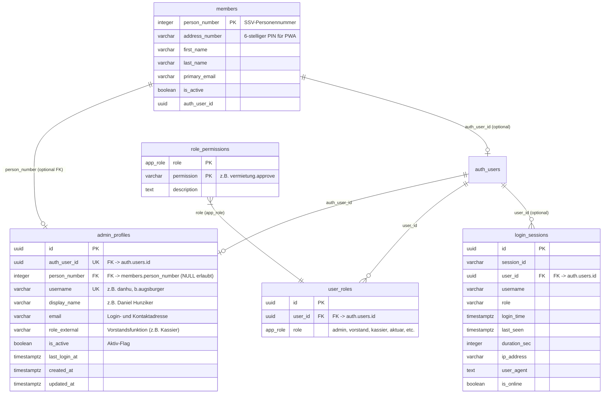

# Fachdokumentation: Logins, Authentifizierung & Berechtigungsverwaltung

> **Status:** PRODUKTIV (Supabase Single Source of Truth)  
> **Stand:** Oktober 2026  
> **Tabellen:** `public.admin_profiles`, `public.login_sessions`, `public.user_roles`, `public.role_permissions`, `auth.users`, `public.members`  
> **Frontend:** [`vorstand/js/logins/`](file:///c:/Users/danhu/.gemini/antigravity/scratch/migration%20supabase/vorstand/js/logins/) (`logins-core.js`, `logins-ui.js`, `logins-actions.js`, `logins-events.js`, `logins.js`), [`vorstand/js/auth.js`](file:///c:/Users/danhu/.gemini/antigravity/scratch/migration%20supabase/vorstand/js/auth.js), [`app.js`](file:///c:/Users/danhu/.gemini/antigravity/scratch/migration%20supabase/app.js)  
> **Relevanz für KI:** Definiert die Authentifizierungs- und Autorisierungsarchitektur für alle drei Frontends (Vorstand-Portal, Mitglieder-App PWA und Vereins-Website), das entkoppelte RBAC-Berechtigungsmodell, die Session-Überwachung und die Ablösung alter Google-Sheet-Mechanismen.

---

## 1. Übersicht & Systemgrenzen

Das Modul **Logins & Benutzerverwaltung** regelt den gesamten Lebenszyklus von Benutzerkonten, Vorstandsrollen, Rechten und Live-Sitzungen im Vereinsportal der Sportschützen Muhen. Es bedient zwei klar getrennte Benutzergruppen:

```text
┌─────────────────────────────────────────────────────────────────────────────────────────────────┐
│                                 BENUTZER-AUTHENTIFIZIERUNG                                      │
├────────────────────────────────────────────────┬────────────────────────────────────────────────┤
│ 1. Vorstand & System-Administratoren           │ 2. Vereinsmitglieder (PWA & Website)           │
│    - Voller Zugriff auf Vorstandsportal        │    - Zugriff auf Schiessdaten, Standblatt, RSVP│
│    - Authentifizierung: Supabase Auth (GoTrue) │    - Authentifizierung: PIN (SSV AddressNr)     │
│    - Passwörter: bcrypt (Salt + Multi-Round)   │      oder direkte Supabase-Mitglieds-Auth      │
│    - Berechtigungen: Entkoppeltes RBAC Matrix  │    - Stammdatenquelle: public.members          │
└────────────────────────────────────────────────┴────────────────────────────────────────────────┘
```

* **Führendes System:** Supabase PostgreSQL & Supabase Auth (GoTrue) bilden die unumstössliche **Single Source of Truth** (Projekt-Richtlinie 2).  
* **Entkopplung:** Sämtliche Alt-Schnittstellen (Google Sheets `login_daten`, `app_login`, `login_sessions` sowie Apps-Script-Timer und Hashing-Skripte `API_Passwort_Hashing.js`) wurden vollständig stillgelegt. Stille Fallbacks sind strikt verboten (Projekt-Richtlinie 1).

---

## 2. Kern-Architektur & Das «Warum» hinter den Designentscheidungen

### 2.1 Warum GoTrue / bcrypt statt Google-Sheet SHA-256 Hashing?
* **Problem im Altsystem:** Im alten Google Sheet `login_daten` wurden Passwörter im Klartext erfasst. Ein Google Apps Script Job (`processSheetHashing`) berechnete daraus periodisch oder per Knopfdruck einen unsalted SHA-256-Hash in Spalte E. Dieser Ansatz war kryptografisch unsicher (Rainbow-Table-Angriffe) und fehleranfällig bei verzögerter Ausführung des Scripts.
* **Lösung & Warum:** Supabase Auth (GoTrue) setzt auf den Industriestandard **bcrypt** mit individuellem Salt und adaptiver Rundenanzahl. Passwörter werden bei der Registrierung / beim Ändern direkt über die GoTrue-Engine verschlüsselt und in der isolierten Systemtabelle `auth.users` persistiert. Das Portal und die Datenbank speichern **niemals** Klartextpasswörter.
* **Passwort-Reset & Magic Links:** GoTrue ermöglicht zudem sichere Passwort-Rücksetz-Links (`resetPasswordForEmail`) und Einmal-Anmelde-Links (Magic Links via `signInWithOtp`), die über den vereinsinternen SMTP-Server versendet und revisionssicher in `public.mail_logs` protokolliert werden.

### 2.2 Warum entkoppeltes RBAC (Rollen & Berechtigungen)?
* **Problem im Altsystem:** Berechtigungen waren im Code hart auf Rollennamen (`kassier`, `admin`, `vorstand`) verdrahtet. Wollte man dem Schützenmeister Zugriff auf Rechnungen oder dem Aktuar Zugriff auf das Inventar geben, musste Quellcode geändert werden.
* **Lösung & Warum:** Ein dreistufiges entkoppeltes Berechtigungsmodell:
  1. `public.user_roles`: Ordnet Benutzerkonten (`auth_user_id`) einer oder mehreren Rollen zu (`app_role` Enum: `admin`, `vorstand`, `kassier`, `aktuar`, `schuetzenmeister`, `vermieter`, `materialwart`, `member`).
  2. `public.role_permissions`: Ordnet jeder Rolle granulare Berechtigungs-Schlüssel zu (z.B. `vermietung.approve`, `finanzen.rechnungen`, `members.edit`).
  3. `public.has_permission(permission_key)`: Datenbankfunktion zur Durchsetzung in Row-Level-Security-Policies (RLS) und im Frontend zur Steuerung der Schreibzugriffe (`hasWriteAccess`).
* **Vorteil:** Organisationsänderungen (z.B. neue Aufgabenverteilung im Vorstand) erfordern null Code-Änderungen, sondern lediglich einen Klick in der interaktiven Matrix von Tab 4.

### 2.3 Warum Live-Sitzungen & Audit (`public.login_sessions`)?
* **Transparenz statt Blindflug:** Das Vorstandsteam arbeitet dezentral. Um inhaltliche Doppelarbeit (z.B. gleichzeitiges Bearbeiten derselben Rechnung oder Mietbuchung) zu vermeiden, sendet jedes geöffnete Vorstandsportal alle 60 Sekunden einen Heartbeat an die RPC-Funktion `public.ping_login_session()`.
* **Automatische Timeout-Bereinigung:** Sitzungen ohne Heartbeat innerhalb von 5 Minuten werden von PostgreSQL automatisch auf `is_online = false` gesetzt.
* **Audit-Sicherheit:** Dauer, IP-Adresse, Gerät/Browser und Anmeldezeitpunkt werden lückenlos protokolliert.

### 2.4 Warum Echtzeit-Bindung an `public.members` und optionale PersonNumber?
* **Admins mit und ohne Vereinsmitgliedschaft:** Ein Vorstandsmitglied (z.B. Aktuar, Kassier) ist in der Regel auch Vereinsmitglied in `public.members`. Seine PersonNumber verknüpft das Admin-Profil direkt mit den SSV-Stammdaten.
* **Externe Administratoren:** Ein externer Webmaster, IT-Beauftragter oder Treuhänder besitzt keine SSV-Lizenz und existiert nicht in `public.members`. Daher ist die Spalte `person_number` in `admin_profiles` zwingend **optional (`NULL`)**.
* **Mitglieder (PIN):** Vereinsmitglieder in Tab 2 werden direkt per Live-REST-Query aus `public.members` dargestellt. Ein manueller Datensync ist überflüssig.

---

## 3. Datenmodell (Kern-Tabellen & Relationen)



---

## 4. Die 4 Tabs der Benutzeroberfläche

| Tab | Bezeichnung | Datenquelle | Hauptfunktionen |
| :--- | :--- | :--- | :--- |
| **Tab 1** | **Vorstand & Admins** | `public.admin_profiles` & `public.user_roles` | Verwaltung von Vorstandskonten, Rollen, Vorstandsfunktionen, Verknüpfung mit Mitgliedern, Passwortvergabe, Versenden von GoTrue-Einladungsmails. |
| **Tab 2** | **Vereinsmitglieder (PIN)** | `public.members` | Übersicht aller aktiven Vereinsmitglieder, Anzeige der 6-stelligen SSV-AddressNumber (PIN), Status des App-Zugangs. |
| **Tab 3** | **Aktive Sitzungen & Audit** | `public.login_sessions` | Live-Präsenzanzeige (wer ist aktuell online?), KPI-Karten (Sitzungen gesamt, Aktive Vorstände online, Durchschnittsdauer), Sitzungs-Auditlog. |
| **Tab 4** | **Rollen & Berechtigungen** | `public.role_permissions` | Interaktives RBAC-Berechtigungsgrid mit Schaltern pro Rolle und Aktion, Live-Persistierung in PostgreSQL, Wildcard-Schutz für Admins. |

---

## 5. Authentifizierungs- & Autorisierungsabläufe

### 5.1 Vorstand-Login (`vorstand/js/auth.js`)
1. Der Benutzer gibt Benutzername, E-Mail oder Mitgliedsnummer ein.
2. `public.resolve_login_identifier(identifier)` löst die Eingabe serverseitig in die registrierte `auth.users`-E-Mail auf.
3. Client sendet Anmeldeanforderung via `supabase.auth.signInWithPassword({ email, password })`.
4. Bei Erfolg ermittelt `applyAuthenticatedUser()` die Rollen aus `public.user_roles` und initialisiert den Session-State (`portal_user`, `portal_role`, `portal_roles`).
5. `public.ping_login_session()` registriert die Sitzung in `public.login_sessions`.

### 5.2 Mitglieder-PWA-Login (`app.js`)
1. Mitglied wählt seinen Namen aus der Mitgliederliste aus oder gibt seine SSV-PersonNumber ein.
2. Eingabe der 6-stelligen PIN (`address_number`).
3. Client validiert die Kombination direkt gegen `public.members`.
4. Nach erfolgreicher Prüfung wird die Sitzung lokal gespeichert und in `public.login_sessions` mit Präfix `pwa_` auditiert.

### 5.3 Passwort-Reset & Aktivierungs-Workflow
* **Ausstehendes Konto:** Wurde ein Admin neu angelegt, aber noch kein Passwort gesetzt, steht der Status auf *«Ausstehend»*.
* **Einladen-Button:** Ein Klick auf *«Einladen»* stösst `loginsSendInvite()` an. Dies ruft `supabase.auth.resetPasswordForEmail()` auf.
* **E-Mail-Zustellung:** Der Benutzer erhält eine E-Mail mit sicherem Einmal-Token. Beim Klick auf den Link öffnet sich das Vorstandsportal mit dem Passwort-Erstellungs-Modal (`#recovery-password-modal`).
* **Audit-Pflicht:** Jeder Linkversand wird mit Empfänger, Timestamp und Status automatisch in `public.mail_logs` protokolliert (Projekt-Richtlinie 2).

---

## 6. Fehleranalyse: Foreign Key Constraint Violation (`admin_profiles_person_number_fkey`)

### Ursache des Fehlers
Beim Erstellen eines neuen Admins trat der folgende Fehler auf:
```text
Fehler beim Speichern: insert or update on table "admin_profiles" violates foreign key constraint "admin_profiles_person_number_fkey"
```

* **Fachlicher Grund:** Die Tabelle `public.admin_profiles` besitzt eine Fremdschlüssel-Bedingung:  
  `FOREIGN KEY (person_number) REFERENCES members(person_number) ON DELETE SET NULL`.
* **Fehlerauslöser im Formular:**
  1. Das Eingabefeld `lf-personnumber` besass den irreführenden Platzhalter `placeholder="z.B. 123456"`.
  2. Tippte ein Anwender dort eine fiktive Nummer, eine PIN oder eine ungültige Mitgliedsnummer ein, die **nicht** in `public.members` existiert, verhinderte PostgreSQL das Speichern mit der genannten Fehlermeldung.
  3. Bei externen Admins (z.B. Webmaster, Treuhänder), die keine SSV-Mitglieder sind, muss das Feld zwingend `NULL` bleiben.
* **Architektonische Lösung:**
  1. **UI-Absicherung:** Klare Trennung im Modal zwischen *"Vereinsmitglied verknüpfen"* (übernimmt die echte `person_number` als feste Referenz) und *"Externer Admin (ohne Mitgliedschaft)"* (setzt `person_number` strikt auf `null`).
  2. **DB-Absicherung (`save_admin_profile` RPC):** Die SQL-Funktion prüft, ob `p_person_number` in `public.members` existiert. Falls nicht, wird der Wert automatisch auf `NULL` gesetzt, anstatt die Transaktion mit einer Constraint-Violation abstürzen zu lassen.

---

## 7. Passwort-Provisioning, Redirect-Routing & Modal-UX (Migration 26)

### 7.1 Direktes Passwort-Provisioning via PostgreSQL
* **Problem mit GoTrue `signUp`:** Supabase GoTrue verweigert bei bereits existierenden Konten das Ändern des Passworts über die clientseitige `signUp()`-Methode. Ein im Admin-Modal neu gesetztes oder korrigiertes Passwort wurde daher stillschweigend von GoTrue ignoriert.
* **Architektonische Lösung:** `public.save_admin_profile()` nimmt das optionale Passwort `p_password` direkt entgegen. PostgreSQL erzeugt bei Neu- und Bestandskonten mit `crypt(p_password, gen_salt('bf', 10))` sofort den validen bcrypt-Hash in `auth.users` und setzt `email_confirmed_at = now()`. Der Admin-Zugang ist damit unmittelbar einsatzbereit.

### 7.2 Dynamische Redirect-URLs & Root-App Forwarder
* **Problem:** Einladungs- und Aktivierungslinks führten standardmässig zur Root-URL (`https://sportschuetzen-muhen.ch` bzw. `https://sps-b55.pages.dev/`), wo kein Passwort-Recovery-Dialog existiert.
* **Lösung:**
  1. `loginsSendInvite()` und `signInWithOtp()` übergeben dynamisch `window.location.origin + window.location.pathname` (Vorstandsportal-URL).
  2. Die Root-[`index.html`](file:///c:/Users/danhu/.gemini/antigravity/scratch/migration%20supabase/index.html) leitet eingehende Auth-Tokens (`#access_token=...`, `type=recovery`, `type=signup`, `type=invite`) automatisch nahtlos an `/vorstand/index.html` weiter.
  3. `vorstand/js/auth.js` öffnet bei allen drei Tokentypen sofort das Modal `#recovery-password-modal`.

### 7.3 Modal-UX bei Magic-Links
* Nach erfolgreichem Absenden des Anmelde-Links wechselt der Schliessen-Button von *«Abbrechen»* auf einen prominenten blauen **«OK»**-Button (`btn-primary`), um Fehlinterpretationen bezüglich des Abbruchs des Versands auszuschliessen.

---

## 8. Härtung: pgcrypto Search-Path & Rollen-Button Hover UX (Migration 27)

### 8.1 Behebung von `gen_salt(unknown, integer) does not exist`
* **Problem:** In PostgreSQL liegt die Erweiterung `pgcrypto` standardmässig im Schema `extensions`. War die RPC-Funktion `public.save_admin_profile` mit `SET search_path = public, auth, pg_temp` deklariert, schlug der Aufruf von `gen_salt()` und `crypt()` mit der Meldung `function gen_salt(unknown, integer) does not exist` fehl, sobald ein Passwort übergeben wurde.
* **Lösung (Migration 27):** 
  1. `SET search_path = public, auth, extensions, pg_temp;`
  2. Funktionsaufrufe schema-qualifiziert absichern: `extensions.crypt(trim(p_password), extensions.gen_salt('bf', 10))`.

### 8.2 Rollen-Button Hover UX im Admin-Modal
* **Problem:** Inaktive Rollen-Chips besassen die Klasse `.bg-white`. Da Bootstrap 5 für `.bg-white` die Deklaration `background-color: #fff !important` setzt und beim Hovern auf `.btn-outline-*` die Textfarbe auf Weiss wechselt (`color: #fff`), wurde der Buttontext weiss auf weissem Grund und verschwand optisch.
* **Lösung:** Entfernen von `bg-white` zugunsten nativer Bootstrap-Outline-Hover-Effekte und dynamischer Kontrastanpassung (`text-dark` bei `warning`/`info`, `text-white` bei dunklen Rollenfarben).

### 8.3 Deaktivierung von Browser-Passwort-Autofill im Admin-Modal
* Das Passwortfeld `#lf-passwort` wurde mit `autocomplete="new-password"` versehen und wird beim Öffnen eines bestehenden Profils explizit auf `''` zurückgesetzt, damit Browser-Passwortmanager nicht versehentlich das Admin-Passwort des aktuell eingeloggten Benutzers eintragen.

---

## 9. Universelles Mitglieder-SSO & Vorstand-Gatekeeper (Migration 46)

### 9.1 Passwortloses Universal-SSO (Magic Link & 6-stelliger OTP-Code)
* **Ablauf:** Vereinsmitglieder können sich in der Web-App und auf der Website passwortlos via E-Mail anmelden. Die RPC `resolve_login_identifier` löst Name, SSV-Nummer oder E-Mail serverseitig auf. Supabase versendet eine E-Mail mit 1-Klick-Link und 6-stelligem Zahlencode.
* **Inline-Code-Verifikation:** Der 6-stellige Code kann direkt im Modal via `supabase.auth.verifyOtp()` eingegeben werden, ohne dass das mobile Gerät die aktuelle Seite verlassen muss.
* **Session-Dauer & Persistenz:** Die Sitzung wird für 60 Tage im Browser persistiert und synchronisiert automatisch zwischen Web-App (`sportschuetzen_user`) und Website (`sm_member_session`).

### 9.2 Strikter Vorstand-Gatekeeper (`vorstand/js/auth.js`)
* **Schutz vor unbefugtem Zugang:** Meldet sich ein reguläres Vereinsmitglied mit der Rolle `member` (ohne Eintrag in `admin_profiles` oder ohne Vorstandsränge) an oder ruft `/vorstand/` auf, verweigert der Gatekeeper in `applyAuthenticatedUser()` den Zutritt sofort, löscht lokale Vorstands-Tokens und leitet zur Mitglieder-App weiter.
* **Server-Schutz:** Sämtliche Vorstands-Tabellen (`invoices`, `accounting_journal`, `rental_requests` etc.) bleiben durch PostgreSQL Row-Level-Security (RLS) serverseitig für reine `member`-Rollen blockiert.

### 9.3 Deutsche E-Mail-Templates (HTML) & GoTrue Mailer-Konfiguration (CT 117)
* **Vereins-Branding & Sprachstandard:** Alle durch Supabase Auth (GoTrue) ausgelösten System-E-Mails (Magic Link / OTP-Token, E-Mail-Bestätigung, Passwort-Reset, Benutzereinladung) nutzen deutsche HTML-Vorlagen mit offiziellem Vereins-Header und -Footer.
* **Storage-Integration:** Die Vorlagen (`magic-link.html`, `confirmation.html`, `recovery.html`, `invite.html`) sind im öffentlichen Storage-Bucket `email-templates` hinterlegt und werden intern direkt über `http://storage:5000/object/public/email-templates/` vom Auth-Container geladen.
* **Konfiguration:** Absendername `SMTP_SENDER_NAME="Sportschützen Muhen"`, deutsche Betreffzeilen (`GOTRUE_MAILER_SUBJECTS_*`) und Host-Whitelist (`GOTRUE_MAILER_EXTERNAL_HOSTS`) sind in `.env` und `docker-compose.yml` verbindlich deklariert.

### 9.4 Resilienz des Logins-Moduls & Stammdaten-Laden der Web-App
* **Logins-Modul im Portal:** Die Einbindung von `vorstand/js/logins/logins-events.js` in `vorstand/index.html` stellt sicher, dass `loadLoginsData()` und sämtliche Modal- und Tab-Handler für Vorstandsmitglieder mit Rolle `admin` fehlerfrei geladen und gerendert werden.
* **Stammdaten in Web-App (`app.js`):** `loadMembersFromSupabase()` fragt gezielt die tatsächlichen Spalten von `public.members` (`person_number, address_number, first_name, last_name, is_active`) mit Filter `is_active=eq.true` ab, sodass das Login-Dropdown sofort mit allen aktiven Vereinsmitgliedern befüllt wird.

### 9.5 Test-Personas & Berechtigungs-Härtung (Migration 47)
* **Vier Test-Personen für End-to-End Testing:**
  1. `1073722` (Daniel Hunziker, `dan.hunziker@hotmail.ch`): Reines Vereinsmitglied (`member`), PIN `125638`. Wird im Vorstandsportal vom Gatekeeper abgewiesen.
  2. `9999999` (Dan Admin, `dan.hunziker@me.com`): Administrator (`admin`, `vorstand`), PIN `999999`. Voller Zugriff auf alle Module inklusive «Logins».
  3. `8888888` (Dan Vorstand, `dan.hunziker@bluewin.ch`): Reguläres Vorstandsmitglied (`vorstand`), PIN `888888`. Zugriff auf Vorstandsbereiche, jedoch kein «Logins»-Menü und keine Buchhaltung.
  4. `7777777` (Dan Kassier, `dan.hunziker@outlook.com`): Kassier (`kassier`, `vorstand`), PIN `777777`. Vollzugriff auf Finanzen, Rechnungen, Buchhaltung und Jahresbeitrag.
* **Einheitliches Test-Passwort:** Für alle Test-Accounts ist das Initialpasswort `Muhen2026!` in `auth.users` hinterlegt; alternativ funktioniert passwortloser Magic-Link / OTP-Code.
* **Rollen-Merge & Admin-Priorisierung (`vorstand/js/auth.js`):** `applyAuthenticatedUser()` führt Rollen aus `user_roles`, JWT und `admin_profiles.role_external` zusammen. Besitzt ein Benutzer die Rolle `admin`, wird diese zwingend an Position 1 gesetzt, sodass administrative Schutzprüfungen (`data-roles="admin"`) stets positiv ausfallen.
* **Erweiterte Identifikator-Auflösung (`resolve_login_identifier`):** Prüft in `admin_profiles` neben `username` und `email` auch `display_name` und `person_number`, sodass auch Eingaben von Namen («Dan Admin») sofort korrekt als Admin aufgelöst werden.

### 9.6 Vorstands-Routing bei E-Mail-Bestätigung (Magic Link & Passwort-Reset)
* **Zielgerichteter Redirect-Kontrakt:** Bei Anforderung eines Magic Links (`signInWithOtp`) oder Passwort-Resets (`resetPasswordForEmail`) aus dem Vorstandsportal wird `redirectTo` explizit auf `.../vorstand/index.html?portal=vorstand` gesetzt, um unkontrollierte Redirects auf das Web-App-Stammverzeichnis zu verhindern.
* **Gatekeeper in `index.html` & `app.js`:** Trifft ein Vorstands-Token oder der Parameter `portal=vorstand` im Stammverzeichnis ein, leiten der `<head>`-Gatekeeper sowie `initLogin()` in `app.js` die Sitzung unter Beibehaltung von Search- und Hash-Parametern unmittelbar an `vorstand/index.html` weiter. Zudem erhalten eingeloggte Vorstandsmitglieder in der Web-App einen Schnellzugriffs-Button «👑 Vorstand».
* **E-Mail-Branding:** Der Subtitle der GoTrue HTML-Templates (`magic-link.html`, `recovery.html`) lautet einheitlich «Vereins- & Vorstandsportal».

---

## 10. RBAC-Durchsetzung (Pilot & Evolution)

Die Durchsetzung der Berechtigungsmatrix (`public.role_permissions`) startete mit der Pilot-Phase (Migration 48) für Navigation/Kacheln und Rechnungswesen und wurde mit Migration 49 auf das vollständige, einheitliche Modell erweitert.

---

## 11. Einheitliches «View & Manage»-Berechtigungsmodell (Migration 49)

### 11.1 Symmetrisches 2-Stufen-Prinzip
Jedes der 20 Fachmodule im Vereinsportal verfügt in der Berechtigungsmatrix über exakt zwei Schalter:
1. **`<modul>.view` (👁️ Einsehen):** Schaltet Dashboard-Kachel und Sidebar-Navigation frei (Read-Only). Daten werden geladen und angezeigt. Mutationsbuttons sind ausgeblendet oder deaktiviert (`.write-protected`).
2. **`<modul>.manage` (✏️ Verwalten):** Schaltet Schreib- und Aktionsfunktionen frei (Speichern, Löschen, Mutieren, Exportieren, Rechnungsstellung etc.) und autorisiert Schreibvorgänge in der PostgreSQL-Datenbank.
*(Wer `manage` besitzt, hat automatisch auch Einsicht in die Kachel und die Tabellen).*

**Ausnahme `Logins`:** Bleibt als Schutz vor Rechte-Eskalation strikt der System-Rolle `admin` vorbehalten.

### 11.2 Die 20 Module & Berechtigungsschlüssel
1. `inventar`: `inventar.view` / `inventar.manage`
2. `termine`: `termine.view` / `termine.manage`
3. `system-mails`: `system-mails.view` / `system-mails.manage`
4. `anlaesse`: `anlaesse.view` / `anlaesse.manage`
5. `umfragen`: `umfragen.view` / `umfragen.manage`
6. `manager`: `manager.view` / `manager.manage`
7. `resultate`: `resultate.view` / `resultate.manage`
8. `vermietung`: `vermietung.view` / `vermietung.manage`
9. `jahresmeisterschaft`: `jahresmeisterschaft.view` / `jahresmeisterschaft.manage`
10. `mail`: `mail.view` / `mail.manage`
11. `jahresbeitrag`: `jahresbeitrag.view` / `jahresbeitrag.manage`
12. `rechnungen`: `rechnungen.view` / `rechnungen.manage`
13. `dokumente`: `dokumente.view` / `dokumente.manage`
14. `buchhaltung`: `buchhaltung.view` / `buchhaltung.manage`
15. `members`: `members.view` / `members.manage`
16. `gv`: `gv.view` / `gv.manage`
17. `archiv`: `archiv.view` / `archiv.manage`
18. `meeting`: `meeting.view` / `meeting.manage`
19. `news`: `news.view` / `news.manage`
20. `galerie`: `galerie.view` / `galerie.manage`

### 11.3 Datenbank-Absicherung (RLS)
* **SELECT Policy:** `(SELECT public.rbac_allows(ARRAY['<modul>.view', '<modul>.manage']))`
* **WRITE Policy (ALL):** `(SELECT public.rbac_allows(ARRAY['<modul>.manage']))`
* **Öffentliche Anon-Zugriffe:** Bleiben unberührt für Website-Funktionen (öffentlicher Kalender auf `termine`, Buchungsanfragen auf `rental_requests`, öffentliche Umfragen auf `poll_events` / `poll_responses`).
* **Rechnungswesen-RLS:** Auslösende Fachmodule (`vermietung.manage`, `inventar.manage`, `jahresbeitrag.manage`, `buchhaltung.manage`, `rechnungen.manage`) besitzen verifizierte Schreibberechtigung auf `invoices`, `invoice_positions`, `invoice_payments`, `external_contacts`.

### 11.4 Frontend-Absicherung
* `window.Perms.VIEW_ACCESS` steuert Kacheln und Sidebar-Links über `['<modul>.view', '<modul>.manage']`.
* `hasWriteAccess(modul)` prüft dynamisch `Perms.has('<modul>.manage')`.
* Manuelle Rollenabfragen (`['admin', 'kassier', ...].includes(r)`) in allen Modulen (`mitglieder`, `jahresbeitrag`, `buchhaltung` etc.) wurden vollständig auf `hasWriteAccess(...)` harmonisiert.

### 11.5 Standard-Regel für zukünftige Module
Wird ein neues Fachmodul zum Vereinsportal hinzugefügt, wird dieses **automatisch ohne gesonderte Aufforderung** mit den beiden Schlüsseln `<modul>.view` und `<modul>.manage` in `RBAC_MODULES` (`logins-core.js`), `VIEW_ACCESS` (`permissions.js`), `MODULE_MANAGE_PERMS` (`main.js`) und den entsprechenden RLS-Policies in PostgreSQL integriert.
