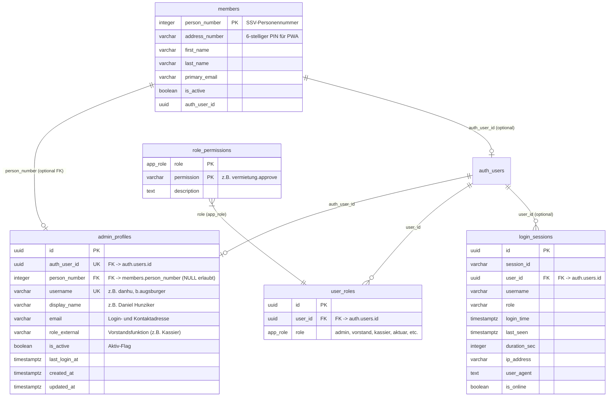

# Fachdokumentation: Logins, Authentifizierung & Berechtigungsverwaltung

> **Status:** PRODUKTIV (Supabase Single Source of Truth)  
> **Stand:** Oktober 2026  
> **Tabellen:** `public.admin_profiles`, `public.login_sessions`, `public.user_roles`, `public.role_permissions`, `auth.users`, `public.members`  
> **Frontend:** [`vorstand/js/logins/`](file:///c:/Users/danhu/.gemini/antigravity/scratch/migration%20supabase/vorstand/js/logins/) (`logins-core.js`, `logins-ui.js`, `logins-actions.js`, `logins-events.js`, `logins.js`), [`vorstand/js/auth.js`](file:///c:/Users/danhu/.gemini/antigravity/scratch/migration%20supabase/vorstand/js/auth.js), [`app.js`](file:///c:/Users/danhu/.gemini/antigravity/scratch/migration%20supabase/app.js)  
> **Relevanz für KI:** Definiert die Authentifizierungs- und Autorisierungsarchitektur für alle drei Frontends (Vorstand-Portal, Mitglieder-App PWA und Vereins-Website), das entkoppelte RBAC-Berechtigungsmodell, die Session-Überwachung und die Ablösung alter Google-Sheet-Mechanismen.

---

## 1. Übersicht & Systemgrenzen

Das Modul **Logins & Benutzerverwaltung** regelt den gesamten Lebenszyklus von Benutzerkonten, Vorstandsrollen, Rechten und Live-Sitzungen im Vereinsportal der Sportschützen Muhen. Es bedient zwei klar getrennte Benutzergruppen:

```text
┌─────────────────────────────────────────────────────────────────────────────────────────────────┐
│                                 BENUTZER-AUTHENTIFIZIERUNG                                      │
├────────────────────────────────────────────────┬────────────────────────────────────────────────┤
│ 1. Vorstand & System-Administratoren           │ 2. Vereinsmitglieder (PWA & Website)           │
│    - Voller Zugriff auf Vorstandsportal        │    - Zugriff auf Schiessdaten, Standblatt, RSVP│
│    - Authentifizierung: Supabase Auth (GoTrue) │    - Authentifizierung: PIN (SSV AddressNr)     │
│    - Passwörter: bcrypt (Salt + Multi-Round)   │      oder direkte Supabase-Mitglieds-Auth      │
│    - Berechtigungen: Entkoppeltes RBAC Matrix  │    - Stammdatenquelle: public.members          │
└────────────────────────────────────────────────┴────────────────────────────────────────────────┘
```

* **Führendes System:** Supabase PostgreSQL & Supabase Auth (GoTrue) bilden die unumstössliche **Single Source of Truth** (Projekt-Richtlinie 2).  
* **Entkopplung:** Sämtliche Alt-Schnittstellen (Google Sheets `login_daten`, `app_login`, `login_sessions` sowie Apps-Script-Timer und Hashing-Skripte `API_Passwort_Hashing.js`) wurden vollständig stillgelegt. Stille Fallbacks sind strikt verboten (Projekt-Richtlinie 1).

---

## 2. Kern-Architektur & Das «Warum» hinter den Designentscheidungen

### 2.1 Warum GoTrue / bcrypt statt Google-Sheet SHA-256 Hashing?
* **Problem im Altsystem:** Im alten Google Sheet `login_daten` wurden Passwörter im Klartext erfasst. Ein Google Apps Script Job (`processSheetHashing`) berechnete daraus periodisch oder per Knopfdruck einen unsalted SHA-256-Hash in Spalte E. Dieser Ansatz war kryptografisch unsicher (Rainbow-Table-Angriffe) und fehleranfällig bei verzögerter Ausführung des Scripts.
* **Lösung & Warum:** Supabase Auth (GoTrue) setzt auf den Industriestandard **bcrypt** mit individuellem Salt und adaptiver Rundenanzahl. Passwörter werden bei der Registrierung / beim Ändern direkt über die GoTrue-Engine verschlüsselt und in der isolierten Systemtabelle `auth.users` persistiert. Das Portal und die Datenbank speichern **niemals** Klartextpasswörter.
* **Passwort-Reset & Magic Links:** GoTrue ermöglicht zudem sichere Passwort-Rücksetz-Links (`resetPasswordForEmail`) und Einmal-Anmelde-Links (Magic Links via `signInWithOtp`), die über den vereinsinternen SMTP-Server versendet und revisionssicher in `public.mail_logs` protokolliert werden.

### 2.2 Warum entkoppeltes RBAC (Rollen & Berechtigungen)?
* **Problem im Altsystem:** Berechtigungen waren im Code hart auf Rollennamen (`kassier`, `admin`, `vorstand`) verdrahtet. Wollte man dem Schützenmeister Zugriff auf Rechnungen oder dem Aktuar Zugriff auf das Inventar geben, musste Quellcode geändert werden.
* **Lösung & Warum:** Ein dreistufiges entkoppeltes Berechtigungsmodell:
  1. `public.user_roles`: Ordnet Benutzerkonten (`auth_user_id`) einer oder mehreren Rollen zu (`app_role` Enum: `admin`, `vorstand`, `kassier`, `aktuar`, `schuetzenmeister`, `vermieter`, `materialwart`, `member`).
  2. `public.role_permissions`: Ordnet jeder Rolle granulare Berechtigungs-Schlüssel zu (z.B. `vermietung.approve`, `finanzen.rechnungen`, `members.edit`).
  3. `public.has_permission(permission_key)`: Datenbankfunktion zur Durchsetzung in Row-Level-Security-Policies (RLS) und im Frontend zur Steuerung der Schreibzugriffe (`hasWriteAccess`).
* **Vorteil:** Organisationsänderungen (z.B. neue Aufgabenverteilung im Vorstand) erfordern null Code-Änderungen, sondern lediglich einen Klick in der interaktiven Matrix von Tab 4.

### 2.3 Warum Live-Sitzungen & Audit (`public.login_sessions`)?
* **Transparenz statt Blindflug:** Das Vorstandsteam arbeitet dezentral. Um inhaltliche Doppelarbeit (z.B. gleichzeitiges Bearbeiten derselben Rechnung oder Mietbuchung) zu vermeiden, sendet jedes geöffnete Vorstandsportal alle 60 Sekunden einen Heartbeat an die RPC-Funktion `public.ping_login_session()`.
* **Automatische Timeout-Bereinigung:** Sitzungen ohne Heartbeat innerhalb von 5 Minuten werden von PostgreSQL automatisch auf `is_online = false` gesetzt.
* **Audit-Sicherheit:** Dauer, IP-Adresse, Gerät/Browser und Anmeldezeitpunkt werden lückenlos protokolliert.

### 2.4 Warum Echtzeit-Bindung an `public.members` und optionale PersonNumber?
* **Admins mit und ohne Vereinsmitgliedschaft:** Ein Vorstandsmitglied (z.B. Aktuar, Kassier) ist in der Regel auch Vereinsmitglied in `public.members`. Seine PersonNumber verknüpft das Admin-Profil direkt mit den SSV-Stammdaten.
* **Externe Administratoren:** Ein externer Webmaster, IT-Beauftragter oder Treuhänder besitzt keine SSV-Lizenz und existiert nicht in `public.members`. Daher ist die Spalte `person_number` in `admin_profiles` zwingend **optional (`NULL`)**.
* **Mitglieder (PIN):** Vereinsmitglieder in Tab 2 werden direkt per Live-REST-Query aus `public.members` dargestellt. Ein manueller Datensync ist überflüssig.

---

## 3. Datenmodell (Kern-Tabellen & Relationen)



---

## 4. Die 4 Tabs der Benutzeroberfläche

| Tab | Bezeichnung | Datenquelle | Hauptfunktionen |
| :--- | :--- | :--- | :--- |
| **Tab 1** | **Vorstand & Admins** | `public.admin_profiles` & `public.user_roles` | Verwaltung von Vorstandskonten, Rollen, Vorstandsfunktionen, Verknüpfung mit Mitgliedern, Passwortvergabe, Versenden von GoTrue-Einladungsmails. |
| **Tab 2** | **Vereinsmitglieder (PIN)** | `public.members` | Übersicht aller aktiven Vereinsmitglieder, Anzeige der 6-stelligen SSV-AddressNumber (PIN), Status des App-Zugangs. |
| **Tab 3** | **Aktive Sitzungen & Audit** | `public.login_sessions` | Live-Präsenzanzeige (wer ist aktuell online?), KPI-Karten (Sitzungen gesamt, Aktive Vorstände online, Durchschnittsdauer), Sitzungs-Auditlog. |
| **Tab 4** | **Rollen & Berechtigungen** | `public.role_permissions` | Interaktives RBAC-Berechtigungsgrid mit Schaltern pro Rolle und Aktion, Live-Persistierung in PostgreSQL, Wildcard-Schutz für Admins. |

---

## 5. Authentifizierungs- & Autorisierungsabläufe

### 5.1 Vorstand-Login (`vorstand/js/auth.js`)
1. Der Benutzer gibt Benutzername, E-Mail oder Mitgliedsnummer ein.
2. `public.resolve_login_identifier(identifier)` löst die Eingabe serverseitig in die registrierte `auth.users`-E-Mail auf.
3. Client sendet Anmeldeanforderung via `supabase.auth.signInWithPassword({ email, password })`.
4. Bei Erfolg ermittelt `applyAuthenticatedUser()` die Rollen aus `public.user_roles` und initialisiert den Session-State (`portal_user`, `portal_role`, `portal_roles`).
5. `public.ping_login_session()` registriert die Sitzung in `public.login_sessions`.

### 5.2 Mitglieder-PWA-Login (`app.js`)
1. Mitglied wählt seinen Namen aus der Mitgliederliste aus oder gibt seine SSV-PersonNumber ein.
2. Eingabe der 6-stelligen PIN (`address_number`).
3. Client validiert die Kombination direkt gegen `public.members`.
4. Nach erfolgreicher Prüfung wird die Sitzung lokal gespeichert und in `public.login_sessions` mit Präfix `pwa_` auditiert.

### 5.3 Passwort-Reset & Aktivierungs-Workflow
* **Ausstehendes Konto:** Wurde ein Admin neu angelegt, aber noch kein Passwort gesetzt, steht der Status auf *«Ausstehend»*.
* **Einladen-Button:** Ein Klick auf *«Einladen»* stösst `loginsSendInvite()` an. Dies ruft `supabase.auth.resetPasswordForEmail()` auf.
* **E-Mail-Zustellung:** Der Benutzer erhält eine E-Mail mit sicherem Einmal-Token. Beim Klick auf den Link öffnet sich das Vorstandsportal mit dem Passwort-Erstellungs-Modal (`#recovery-password-modal`).
* **Audit-Pflicht:** Jeder Linkversand wird mit Empfänger, Timestamp und Status automatisch in `public.mail_logs` protokolliert (Projekt-Richtlinie 2).

---

## 6. Fehleranalyse: Foreign Key Constraint Violation (`admin_profiles_person_number_fkey`)

### Ursache des Fehlers
Beim Erstellen eines neuen Admins trat der folgende Fehler auf:
```text
Fehler beim Speichern: insert or update on table "admin_profiles" violates foreign key constraint "admin_profiles_person_number_fkey"
```

* **Fachlicher Grund:** Die Tabelle `public.admin_profiles` besitzt eine Fremdschlüssel-Bedingung:  
  `FOREIGN KEY (person_number) REFERENCES members(person_number) ON DELETE SET NULL`.
* **Fehlerauslöser im Formular:**
  1. Das Eingabefeld `lf-personnumber` besass den irreführenden Platzhalter `placeholder="z.B. 123456"`.
  2. Tippte ein Anwender dort eine fiktive Nummer, eine PIN oder eine ungültige Mitgliedsnummer ein, die **nicht** in `public.members` existiert, verhinderte PostgreSQL das Speichern mit der genannten Fehlermeldung.
  3. Bei externen Admins (z.B. Webmaster, Treuhänder), die keine SSV-Mitglieder sind, muss das Feld zwingend `NULL` bleiben.
* **Architektonische Lösung:**
  1. **UI-Absicherung:** Klare Trennung im Modal zwischen *"Vereinsmitglied verknüpfen"* (übernimmt die echte `person_number` als feste Referenz) und *"Externer Admin (ohne Mitgliedschaft)"* (setzt `person_number` strikt auf `null`).
  2. **DB-Absicherung (`save_admin_profile` RPC):** Die SQL-Funktion prüft, ob `p_person_number` in `public.members` existiert. Falls nicht, wird der Wert automatisch auf `NULL` gesetzt, anstatt die Transaktion mit einer Constraint-Violation abstürzen zu lassen.
